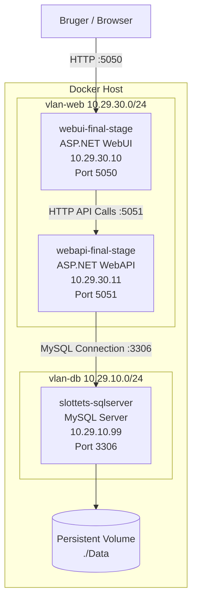
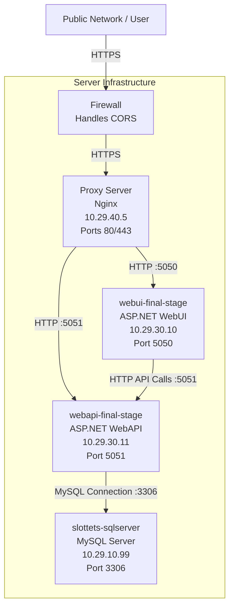

# Deployment Diagram

## køre på lokalt maskine som monolitisk applikation

---

## Alternative Deployment Diagram (with Proxy Server)

### Noter

- Firewall for Web (kan være en del af serveren)
  - håndtere cors
  - håndtere begrænsninger for egress og ingress
