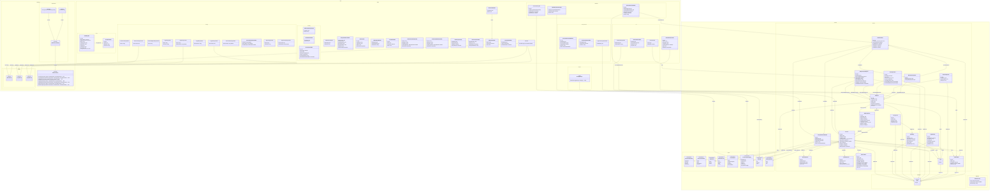

# DCD for hele systemet, inkludert login/auth klasser

```mermaid
classDiagram
  direction TB

  %% Clean architecture

  namespace Domain.Enums {
    class AnonymizationStatus {
      <<enumeration>>
      Suggested
      Approved
      Rejected
      Anonymized
    }
    class DbConnectionState {
      <<enumeration>>
      Online,
      Offline,
      Reconnecting,
      Unknown
    }
    class Department {
      <<enumeration>>
      Slottet,
      Skoven,
      Marken
    }
    class IncidentSeverity {
      <<enumeration>>
      Low,
      Medium,
      High,
      Critical
    }
    class IncidentStatus {
      <<enumeration>>
      Open,
      UnderInvestigation,
      Closed,
      Escalated,
      BreachNotified
    }
    class RetentionDataCategory {
      <<enumeration>>
      MedicineLogs,
      ResidentNotes,
      AuditLogs,
      LoginLogs,
      InactiveUsers,
      AnonymizationTrigger
    }
    class ShiftType {
      <<enumeration>>
      Day,
      Evening,
      Night
    }
    class TrafficLightStatus {
      <<enumeration>>
      Green
      Yellow
      Red
    }
  }

  namespace Domain.Interfaces {
    class IEntity {
      <<interface>>
      +Id: guid
    }
  }

  namespace Domain.Entities {
    class AnonymizationCandidate {
      +Id: guid
      +ResidentId: guid
      +RetentionPolicyId: guid
      +SuggestedAt: DateTime
      +Reason: string
      +Status: AnonymizationStatus
    }

    class AuditEntry {
      +Id: guid
      +Metadata: string
      +StartTimeUtc: DateTime
      +EndTimeUtc: DateTime
      +Succeeded: bool
      +UserId: guid
      +ErrorMessage: string
    }

    class ChangeDetail {
      +Id: guid
      +Field: string
      +OldValue: string
      +NewValue: string
      +AuditEntryId: guid
    }
    class Employee {
      +Id: guid
      +FirstName: string
      +LastName: string
      +Initials: string
      +UserId: guid
      +Department: Department
      *StaffAssignments: ICollection<StaffAssignment>
      *User: User
    }
    class LoginAttempt {
      +Id: guid
      +AttemptedAt: DateTime
      +EmailHash: string
      +UserId: guid
      +Timestamp: DateTime
      +Succeeded: bool
      +IpAddress: string
    }
    class MedicineRecord {
      +Id: guid
      +ResidentId: guid
      +MedicineName: string
      +Timestamp: DateTime
      +Given: bool
    }
    class PainkillerRecord {
      +Id: guid
      +ResidentId: guid
      +Type: string
      +GivenAt: DateTime
      +NextAllowedTime: DateTime
    }
    class PhoneAssignment {
      +Id: guid
      +CaregiverId: guid
      +PhoneNumber: string
      +ShiftType: string
    }
    class RefreshToken {
      +Id: guid
      +UserId: guid
      +TokenHash: string
      +ExpiresAt: DateTime
      +CreatedAt: DateTime
      +RevokedAt: DateTime Nullable
      +CreatedByIp: string Nullable
      +RevokedByIp: string Nullable
      +RevokedReason: string Nullable
      *User: User
    }
    class Resident {
      +Id: guid
      +Initials: string
      +FirstName: string
      +LastName: string
      +TrafficLightStatus: TrafficLightStatus
      +Department: Department
      +DischargedAt: DateTime Nullable
      *Notes: ICollection<ResidentNote>
      *Medicines: ICollection<ResidentMedicine>
      *Painkillers: ICollection<ResidentPainkiller>
      *StaffAssignments: ICollection<StaffAssignment>
    }
    class ResidentNote {
      +Id: guid
      +Note: string
      +CreatedAt: DateTime
      +EditedAt: DateTime Nullable
      +ResidentId: guid
    }
    class SubjectAccessRequest {
      +Id: guid
      +ResidentId: guid
      +RequestedByEmployeeId: guid
      +RequestedAt: DateTime
      +ScopeOptions: string
      +ExportFileName: string
      +ExportGeneratedAt: DateTime
      +FulfilledAt: DateTime Nullable
      +FulfilledByEmployeeId: guid Nullable
    }
    class SecurityIncident {
      +Id: guid
      +DetectedAt: DateTime
      +Type: string
      +Severity: IncidentSeverity
      +Status: IncidentStatus
      +InvestigationNotes: string
      +ReportedByEmployeeId: guid Nullable
      +ResolvedByEmployeeId: guid Nullable
    }
    class RetentionPolicy {
      +Id: guid
      +Category: RetentionDataCategory
      +RetentionPeriod: TimeSpan
      +LegalMinimum: TimeSpan
      +EffectiveFrom: TimeDate
      *AuditHistory: ICollection<RetentionPolicyAudit>
      *Candidates: ICollection<AnonymizationCandidate>
    }
    class RetentionPolicyAudit {
      +Id: guid
      +RetentionPolicyId: guid
      +ChangedByEmployeeId: guid
    }
    class User {
      +Id: guid
    }
    class StaffAssignment {
      +Id: guid
      +ResidentId: guid
      +EmployeeId: guid
      +ShiftType: ShiftType
      +AssignmentDate: DateTime
      +CreatedAt: DateTime
      +UpdatedAt: DateTime Nullable
      *Resident: Resident
      *Employee: Employee
    }
  }

  namespace Domain.UiModels {
    class DataConnection {
      +State: DbConnectionState
      +LastChecked: DateTime Nullable
      +ErrorMessage: string
    }
  }

  namespace Core.Interfaces {
    class ICRUD~TEntity~ {
      <<interface>>
      +CreateAsync(entity: TEntity, cancellationToken: CancellationToken): Task<TEntity>
      +CreateRangeAsync(entities: IEnumerable<TEntity>, cancellationToken: CancellationToken): Task<IEnumerable<TEntity>>
      +GetByIdAsync(id: guid, cancellationToken: CancellationToken): Task<TEntity?>
      +GetAllAsync(cancellationToken: CancellationToken): Task<IEnumerable<TEntity>>
      +UpdateAsync(entity: TEntity, cancellationToken: CancellationToken): Task
      +UpdateRangeAsync(entities: IEnumerable<TEntity>, cancellationToken: CancellationToken): Task
      +DeleteAsync(entity: TEntity, cancellationToken: CancellationToken): Task
      +DeleteRangeAsync(entities: IEnumerable<TEntity>, cancellationToken: CancellationToken): Task
    }
  }

  namespace Core.Interfaces.Repositories {
    class IRepository~TEntity~ {
      <<interface>>
    }
    class IUserRepository {
      <<interface>>
    }
    class IAnonymizationCandidateRepository {
      <<interface>>
    }
  }

  namespace Core.DTOs {
    class AddResidentNoteDto {
      +ResidentId: guid
      +NoteText: string
    }
    class AssignmentOverviewDto {
      +AssignmentId: guid
      +ResidentId: guid
      +ResidentInitials: string
      +EmployeeId: guid
      +EmployeeName: string
      +ShiftType: string
      +AssignmentDate: DateTime
    }
    class EmployeeDto {
      +Id: guid
      +FirstName: string
      +LastName: string
      +Initials: string
      +Department: Department
    }
    class EditResidentNoteDto {
      +ResidentId: guid
      +ResidentNoteId: guid
      +NewNoteText: string
    }
    class ErrorDto {
      +ErrorMessages: IEnumerable<string> Nullable
    }
    class ResidentNoteDto {
      +Id: guid
      +Note: string
      +Timestamp: DateTime
      +Initials: string
    }
    class ResidentCreateRequestDto {
      +Initials: string
      +FirstName: string
      +LastName: string
      +TrafficLightStatus: TrafficLightStatus Nullable
      +Department: Department
    }
    class ResidentUpdateRequestDto {
      +Initials: string
      +FirstName: string
      +LastName: string
      +TrafficLightStatus: TrafficLightStatus Nullable
      +Department: Department
    }
    class ResidentResponseDto {
      +Id: guid
      +Initials: string
      +FirstName: string
      +LastName: string
      +TrafficLightStatus: int Nullable
      +Notes: List<ResidentNoteDto>
      +Department: Department
    }
    class StaffAssignmentDto {
      +ResidentId: guid
      +EmployeeId: guid
      +ShiftType: ShiftType
      +AssignmentDate: DateTime
    }
    class PhoneAssignmentDto {
      +PhoneNumber: string
      +ShiftType: string
      +ShiftTypeEnum: ShiftType
      +AssignedStaffName: string
    }
    class MedicineEntryDto {
      +Name: string
      +Timestamp: DateTime
      +Given: bool
    }
    class MedicineStatusDto {
      +ResidentId: guid
      +Entries: List<MedicineEntryDto>
    }
    class PainkillerStatusDto {
      +ResidentId: guid
      +Types: IEnumerable<string>
      +NextAllowedTime: DateTime
    }
  }

  namespace Core.DTOs.Audit {
    class AuditEntryDto {
      +Id: guid
      +EventTimeUtc: DateTime
      +RegisteredTimeUtc: DateTime
      +Entity: string
      +ChangeType: string
      +Description: string
      +UserId: guid
      +UserName: string
      +Succeeded: bool
      +ChangeDetails: IEnumerable<ChangeDetailDto>
    }
    class ChangeDetailDto {
      +Id: guid
      +Field: string
      +OldValue: string
      +NewValue: string
    }
  }

  namespace Core.DTOs.Retention {
    class RetentionPolicyDto {
      +Id: guid
      +Category: RetentionDataCategory
      +RetentionPeriod: TimeSpan
      +LegalMinimum: TimeSpan
      +EffectiveFrom: DateTime
    }
    class RetentionPolicyAuditDto {
      +Id: guid
      +RetentionPolicyId: guid
      +ChangedByEmployeeId: guid
      +PreviousPeriod: TimeSpan
      +NewPeriod: TimeSpan
      +ChangedAt: DateTime
      +Reason: string
    }
    class UpdateRetentionPolicyDto {
      +Category: RetentionDataCategory
      +RetentionPeriod: TimeSpan
      +Reason: string
    }
  }

  namespace Core.DTOs.Anonymization {
    class AnonymizationCandidateDto {
      +Id: guid
      +ResidentId: guid
      +RetentionPolicyId: guid
      +SuggestedAt: DateTime
      +Reason: string
      +Status: AnonymizationStatus
    }
    class AnonymizationResultDto {
      +CandidateId: guid
      +CompletedAt: DateTime
      +Outcome: string
    }
    class ApproveAnonymizationDto {
      +CandidateId: guid
    }
  }

  namespace Core.DTOs.Identity {
    class DeleteUserRequestDto {
      +UserId: string
    }
    class DeleteUserResponseDto {
      +IsSuccessful: bool
    }
    class GetUserIdByEmailRequestDto {
      +Email: string
    }
    class LoginRequestDto {
      +Email: string
      +Password: string
    }
    class LoginResponseDto {
      +Token: string
      +RefreshToken: string Nullable
    }
    class LogoutRequestDto {
      +RefreshToken: string
    }
    class LogoutResponseDto {
      +IsSuccessful: bool
    }
    class RefreshTokenRequestDto {
      +RefreshToken: string Nullable
    }
    class RefreshTokenResponseDto {
      +JwtToken: string Nullable
      +RefreshToken: string Nullable
      +ErrorMessages: IEnumerable<string> Nullable
    }
    class RegisterRequestDto {
      +Email: string
      +Password: string
    }
    class RegistrationResponseDto {
      +IsSuccessful: bool
      +ErrorMessages: IEnumerable<string>
    }
  }

  namespace Core.DTOs.Sar {
    class SarExportRequestDto {
      +ResidentId: guid
      +ScopeOptions: string[]
    }
    class SarExportPackageDto {
      +ExportId: guid
      +GeneratedAt: DateTime
      +FileName: string
      +Payload: string
    }
    class SarFulfilledDto {
      +SarId: guid
      +FulfilledAt: DateTime
    }
  }

  namespace Core.Helpers {
    class ShiftTypeHelper {
      <<static>>
      +ToDanishString(shiftType: ShiftType): string
    }
  }

  namespace Core.DTOs.Security {
    class AddInvestigationNotesDto {
      +IncidentId: guid
      +Notes: string
    }
    class EscalateIncidentDto {
      +IncidentId: guid
      +IsBreach: bool
    }
    class SecurityIncidentDto {
      +Id: guid
      +DetectedAt: DateTime
      +Type: string
      +Severity: IncidentSeverity
      +Status: IncidentStatus
      +InvestigationNotes: string
      +BreachNotificationDeadlineUtc: DateTime
    }
  }

  namespace Core.Interfaces.Dto.Identity {
    class IDeleteResult {
      <<interface>>
    }
    class ILoginResult {
      <<interface>>
    }
    class ILogoutResult {
      <<interface>>
    }
  }

  %% Associations
  AnonymizationCandidate --> AnonymizationStatus : Status
  AnonymizationCandidate --> User : ResidentId
  AnonymizationCandidate --> RetentionDataCategory : RetentionPolicyId
  AuditEntry --> User : UserId
  ChangeDetail --> AuditEntry : AuditEntryId
  Employee --> Department : Department
  Employee --> User : UserId
  Employee --> StaffAssignment : StaffAssignments
  LoginAttempt --> User : UserId
  SubjectAccessRequest --> Resident : ResidentId
  SubjectAccessRequest --> Employee : RequestedByEmployeeId
  SubjectAccessRequest --> Employee : FulfilledByEmployeeId
  SecurityIncident --> Employee : ReportedByEmployeeId
  SecurityIncident --> Employee : ResolvedByEmployeeId
  Resident --> Department : Department
  Resident --> TrafficLightStatus : TrafficLightStatus
  Resident --> ResidentNote : Notes
  Resident --> MedicineRecord : Medicines
  Resident --> PainkillerRecord : Painkillers
  Resident --> StaffAssignment : StaffAssignments
  MedicineRecord --> Resident : ResidentId
  PainkillerRecord --> Resident : ResidentId
  PhoneAssignment --> Employee : CaregiverId
  ResidentNote --> Resident : ResidentId
  ResidentResponseDto --> ResidentNote : Notes
  MedicineStatusDto --> MedicineEntryDto : Entries
  AuditEntryDto --> ChangeDetailDto : ChangeDetails
  ApproveAnonymizationDto --> AnonymizationCandidate : CandidateId
  SarExportRequestDto --> Resident : ResidentId
  SarFulfilledDto --> SubjectAccessRequest : SarId
  RetentionPolicyDto --> RetentionDataCategory : Category
  UpdateRetentionPolicyDto --> RetentionDataCategory : Category
  RetentionPolicy --> RetentionDataCategory : Category
  RetentionPolicy --> RetentionPolicyAudit : AuditHistory
  RetentionPolicy --> AnonymizationCandidate : Candidates
  RetentionPolicyAudit --> RetentionPolicy : RetentionPolicyId
  RetentionPolicyAudit --> Employee : ChangedByEmployeeId
  RetentionPolicyAuditDto --> RetentionPolicy : RetentionPolicyId
  RetentionPolicyAuditDto --> Employee : ChangedByEmployeeId

  StaffAssignment --> Resident : ResidentId
  StaffAssignment --> Employee : EmployeeId

  ShiftTypeHelper --> ShiftType : ToDanishString

  IRepository~TEntity~ --|> ICRUD~TEntity~ : extends
  IAnonymizationCandidateRepository --|> IRepository~AnonymizationCandidate~ : extends
  IUserRepository --|> IRepository~User~ : extends

  DeleteUserResponseDto --|> IDeleteResult : implements
  LoginResponseDto --|> ILoginResult : implements
  LogoutResponseDto --|> ILogoutResult : implements

  ErrorDto --|> ILoginResult : implements
  ErrorDto --|> ILogoutResult : implements
  ErrorDto --|> IDeleteResult : implements

  %% Realization (Interface Implementation)
  AnonymizationCandidate --|> IEntity : implements
  AuditEntry --|> IEntity : implements
  ChangeDetail --|> IEntity : implements
  Employee --|> IEntity : implements
  LoginAttempt --|> IEntity : implements
  SubjectAccessRequest --|> IEntity : implements
  SecurityIncident --|> IEntity : implements
  Resident --|> IEntity : implements
  User --|> IEntity : implements
  PhoneAssignment --|> IEntity : implements
  ResidentNote --|> IEntity : implements
  RetentionPolicy --|> IEntity : implements
```
