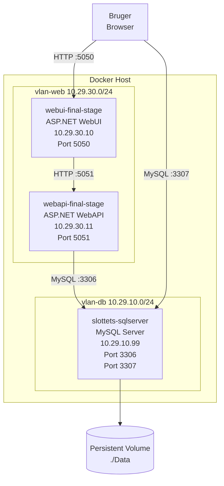
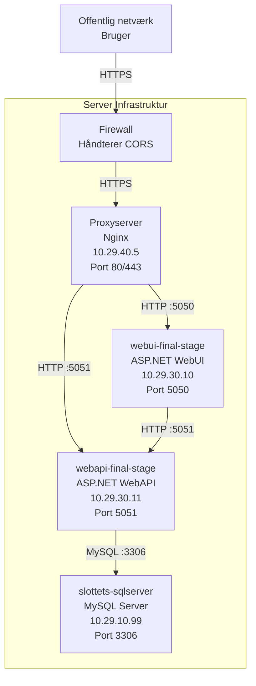

# Deploymentsdiagram

## Kørsel på lokal maskine som monolitisk applikation

**Scenarie:**
Denne opsætning anvendes til lokal udvikling og test, hvor hele applikationen kører som en monolit på én maskine. Alle komponenter er tilgængelige internt via lokale netværk uden ekstern adgang.

---

## Alternativt deploymentsdiagram (med proxyserver)

**Scenarie:**
Denne opsætning anvendes til produktion eller testmiljøer, hvor adgang fra internettet styres via en firewall og proxyserver. Firewall håndterer CORS og sikkerhed, mens proxyen videresender trafik til relevante tjenester. MySQL-databasen er isoleret og kun tilgængelig for WebAPI.

### Noter

- Firewall håndterer CORS og begrænser adgang (kan være del af serveren).
- HTTP bruges internt for ydeevne, men HTTPS anbefales hvis netværket ikke er isoleret.
