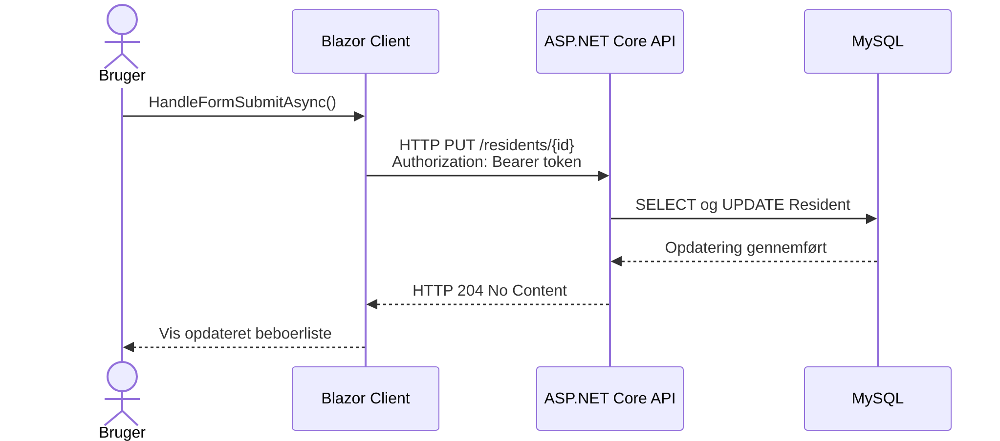
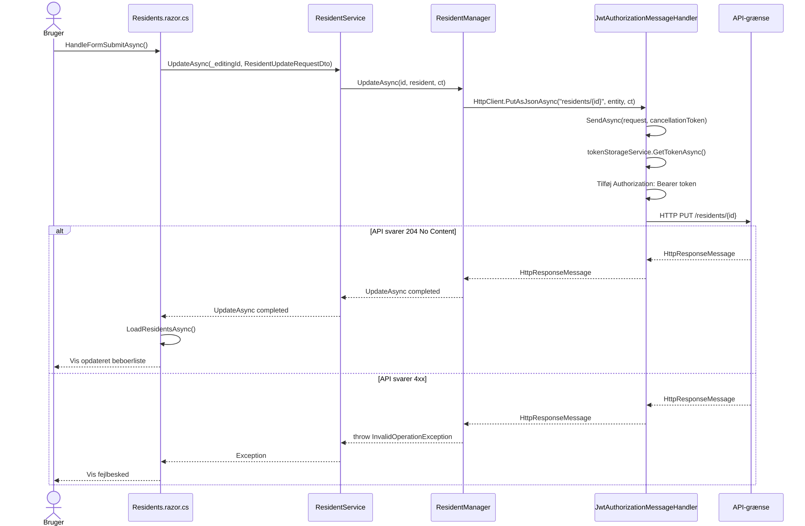
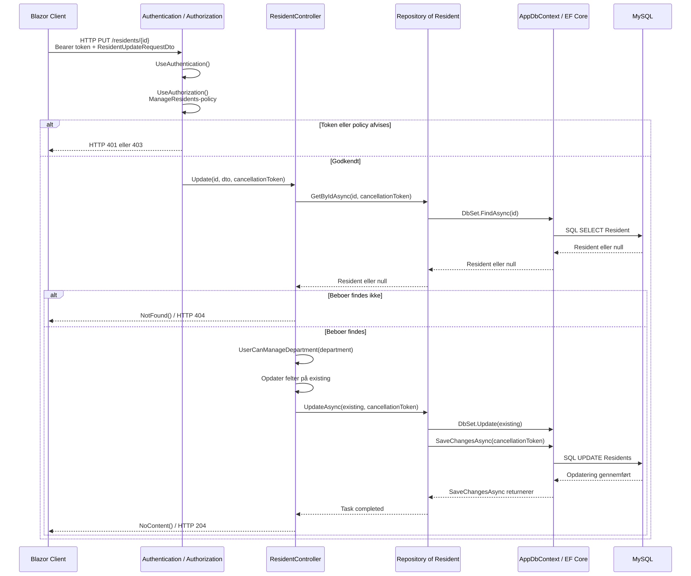
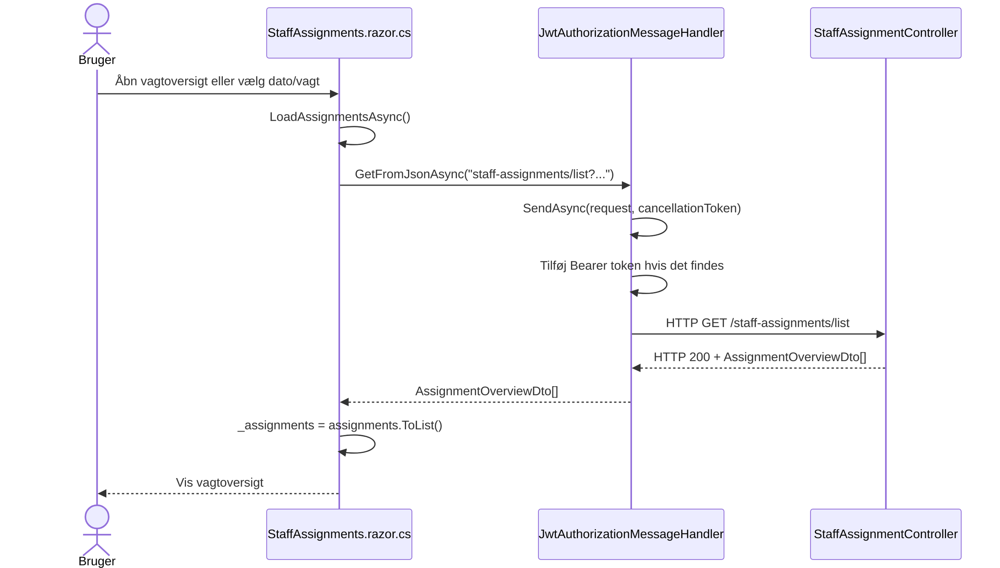
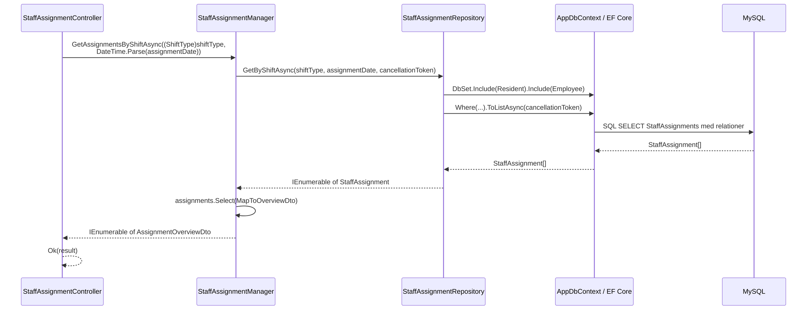

# Sequence Diagrams - Implementerede Runtime-flows

## Formål

Diagrammerne viser projektets faktiske metodekald. De er opdelt ved HTTP-grænsen,
så teksten kan læses i VS Codes Markdown Preview uden kraftig zoom.

- **Client-side:** Koden kører i Blazor WebAssembly i browseren.
- **Server-side:** Koden kører i ASP.NET Core API'et.
- **Grænsen:** Et HTTP-request sendes fra clienten til API'et.

Det oprindelige, planlagte sekvensdiagram er bevaret separat i
`docs/Examen/sekvens-diagram.md`.

---

## Opdater Beboer - Samlet Oversigt

## Opdater Beboer - Client-side

Alt i dette diagram kører i browseren. Det sidste kald sender requestet over
client/server-grænsen.

### Client-metoder at finde

1. `Residents.HandleFormSubmitAsync()`
2. `ResidentService.UpdateAsync(Guid, ResidentUpdateRequestDto, CancellationToken)`
3. `ResidentManager.UpdateAsync(Guid, ResidentUpdateRequestDto, CancellationToken)`
4. `JwtAuthorizationMessageHandler.SendAsync(HttpRequestMessage, CancellationToken)`

## Opdater Beboer - Server-side

Dette diagram begynder, når API'et modtager `PUT /residents/{id}`.

### Server-metoder at finde

1. `ResidentController.Update(Guid, ResidentUpdateRequestDto, CancellationToken)`
2. `ResidentController.UserCanManageDepartment(Department)`
3. `Repository<Resident>.GetByIdAsync(Guid, CancellationToken)`
4. `Repository<Resident>.UpdateAsync(Resident, CancellationToken)`
5. EF Core-metoderne `FindAsync()` og `SaveChangesAsync()`

---

## Hent Vagtoversigt - Client til API

Vagtoversigten kalder API'et direkte fra Blazor-komponenten. Den bruger ikke et
client-side Core-service til dette request.

## Hent Vagtoversigt - API til Database

### Vagtoversigt-metoder at finde

1. `StaffAssignments.LoadAssignmentsAsync()`
2. `JwtAuthorizationMessageHandler.SendAsync(HttpRequestMessage, CancellationToken)`
3. `StaffAssignmentController.GetAssignments(int, string)`
4. `StaffAssignmentManager.GetAssignmentsByShiftAsync(ShiftType, DateTime, CancellationToken)`
5. `StaffAssignmentRepository.GetByShiftAsync(ShiftType, DateTime, CancellationToken)`
6. EF Core-metoden `ToListAsync(CancellationToken)`

---

## Sådan Følges Et Nyt Flow Uden Debugging

1. Start ved brugerhandlingen i en `.razor.cs`-fil.
2. Find event-handleren, eksempelvis `HandleFormSubmitAsync()`.
3. Brug **Peek Call Hierarchy**, **Find All References** og `Cmd + klik`.
4. Hvis kaldet rammer et interface, brug **Go to Implementations**.
5. Når du finder `GetFromJsonAsync`, `PostAsJsonAsync`, `PutAsJsonAsync` eller
   `DeleteAsync`, har du fundet client/server-grænsen.
6. Match URL'en med API-controllerens `[Route]` og HTTP-attribut.
7. Følg controllerens injected service eller repository.
8. `SaveChangesAsync`, `ToListAsync`, `FindAsync` og `FirstOrDefaultAsync`
   markerer normalt kommunikationen gennem EF Core til MySQL.

## Vigtig Arkitektur-Bemærkning

Ved HTTP-kald fra WebUI:

`Blazor Client -> Core-service eller direkte HttpClient -> JWT-handler -> WebApi`

Ved API-kald mod databasen:

`WebApi -> service/repository -> Infrastructure.Data -> AppDbContext/EF Core -> MySQL`
