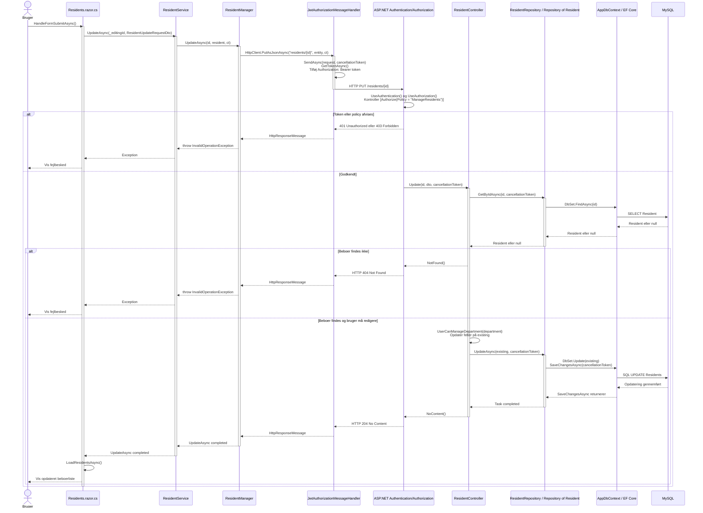
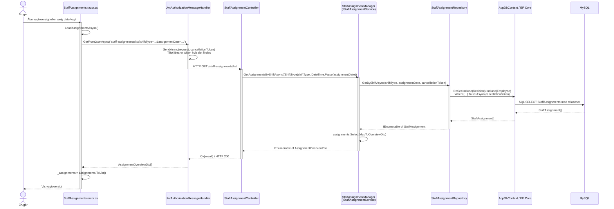

# Sequence Diagrams - Implementerede Runtime-flows

## Formål

Disse sekvensdiagrammer viser de faktiske metodekald i projektet. Navnene kan
derfor findes direkte i koden og bruges som breakpoints under en demonstration.

Projektet har ikke ét ensartet flow for alle funktioner:

- Opdatering af en beboer går gennem et Core-service og en HTTP-manager.
- Hentning af vagtoversigten kalder API'et direkte fra Blazor-komponenten.
- Flere API-controllere kalder repositories direkte, mens andre kalder services.

---

## Opdater Beboer - Faktisk Implementeret Flow

Udgangspunktet er administrationssiden for beboere. Brugeren redigerer en
beboer og indsender formularen.

### Metoder at finde og sætte breakpoints i

1. `Residents.HandleFormSubmitAsync()`
2. `ResidentService.UpdateAsync(Guid, ResidentUpdateRequestDto, CancellationToken)`
3. `ResidentManager.UpdateAsync(Guid, ResidentUpdateRequestDto, CancellationToken)`
4. `JwtAuthorizationMessageHandler.SendAsync(HttpRequestMessage, CancellationToken)`
5. `ResidentController.Update(Guid, ResidentUpdateRequestDto, CancellationToken)`
6. `Repository<Resident>.GetByIdAsync(Guid, CancellationToken)`
7. `Repository<Resident>.UpdateAsync(Resident, CancellationToken)`
8. `AppDbContext.SaveChangesAsync()` kaldes af repositoryet via EF Core

---

## Hent Vagtoversigt - Faktisk Implementeret Flow

Dette flow går direkte fra Blazor-komponenten til API'et. Der er ikke et
klient-side Core-service mellem siden og API'et.

### Metoder at finde og sætte breakpoints i

1. `StaffAssignments.LoadAssignmentsAsync()`
2. `JwtAuthorizationMessageHandler.SendAsync(HttpRequestMessage, CancellationToken)`
3. `StaffAssignmentController.GetAssignments(int, string)`
4. `StaffAssignmentManager.GetAssignmentsByShiftAsync(ShiftType, DateTime, CancellationToken)`
5. `StaffAssignmentRepository.GetByShiftAsync(ShiftType, DateTime, CancellationToken)`
6. EF Core-metoden `ToListAsync(CancellationToken)`

---

## Sådan Følges Et Nyt Flow

1. Start ved brugerhandlingen i en `.razor.cs`-fil.
2. Find event-handleren, eksempelvis `HandleFormSubmitAsync()`.
3. Følg hvert metodekald med `Cmd + klik` eller `F12`.
4. Hvis kaldet rammer et interface, find implementeringen i en
   `DependencyInjection.cs`-fil.
5. Når du finder `GetFromJsonAsync`, `PostAsJsonAsync`, `PutAsJsonAsync` eller
   `DeleteAsync`, stopper det lokale call stack. Kaldet fortsætter som HTTP.
6. Match URL'en med API-controllerens `[Route]` og `[HttpGet]`, `[HttpPost]`,
   `[HttpPut]` eller `[HttpDelete]`.
7. Følg controllerens injected service eller repository.
8. Når du finder `SaveChangesAsync`, `ToListAsync`, `FindAsync` eller
   `FirstOrDefaultAsync`, kommunikerer EF Core med MySQL.
9. Følg returværdien baglæns til UI'et.

## Vigtig Arkitektur-Bemærkning

Det tidligere diagram viste `Infrastructure.Data -> WebApi`. Det er ikke det
implementerede runtime-flow. Ved API-kald er retningen:

`WebApi -> service/repository -> Infrastructure.Data -> AppDbContext/EF Core -> MySQL`

Ved HTTP-kald fra WebUI er retningen:

`Blazor WebUI -> Core-service eller direkte HttpClient -> HTTP-manager/JWT-handler -> WebApi`
