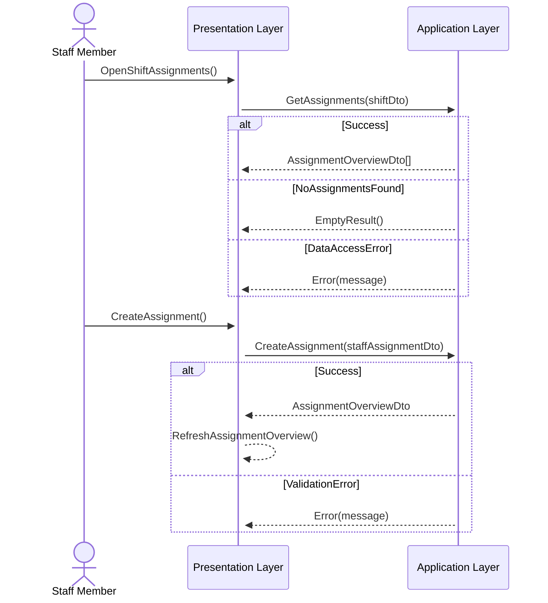
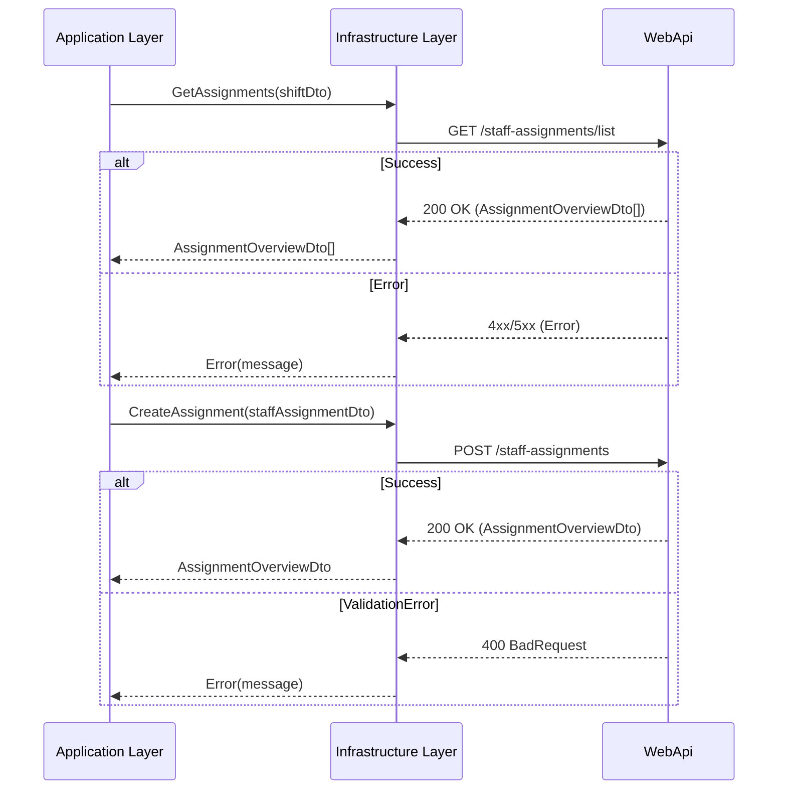

# Sequence Diagram – Shift Change and Citizen Status Update

## Description

Dette sekvensdiagram beskriver dataflowet under et vagtskifte, hvor en medarbejder ser aktuelle opgaver og opdaterer en borger/beboerstatus i systemet.

Diagrammet viser, hvordan frontend, API, tjenester, repositories og database interagerer under processen.

Flowet følger den systemarkitektur, der blev anvendt i projektet:
- Blazor WebUI frontend
- ASP.NET Core API-controllere
- Servicelag
- Repository/Datalag
- MySQL-database med Entity Framework Core

---

## Mermaid Sequence Diagram

## Presentation → Application

### WebApi Layer → Infrastructure Layer (Data Access)

---

## Notes
- Scope: indlæsning og opdatering af staff assignments under vagtskifte.
- Presentation Layer anmoder om assignment-data og viser aktuelle ansvarsområder.
- Staff assignments opdateres gennem WebApi-laget.
- Infrastrukturkommunikation abstraheres gennem manager-klasser.
- DTO’er anvendes på tværs af arkitektoniske lag.
- Beskyttede endpoints kræver JWT authentication og authorization.
- Arkitekturen følger Clean Architecture dependency direction.

## Compliance
- Følger Clean Architecture-principper.
- Benytter Mermaid sequence diagrams.
- Følger projektets dokumentationsstruktur.
- Versionslog vedligeholdes.