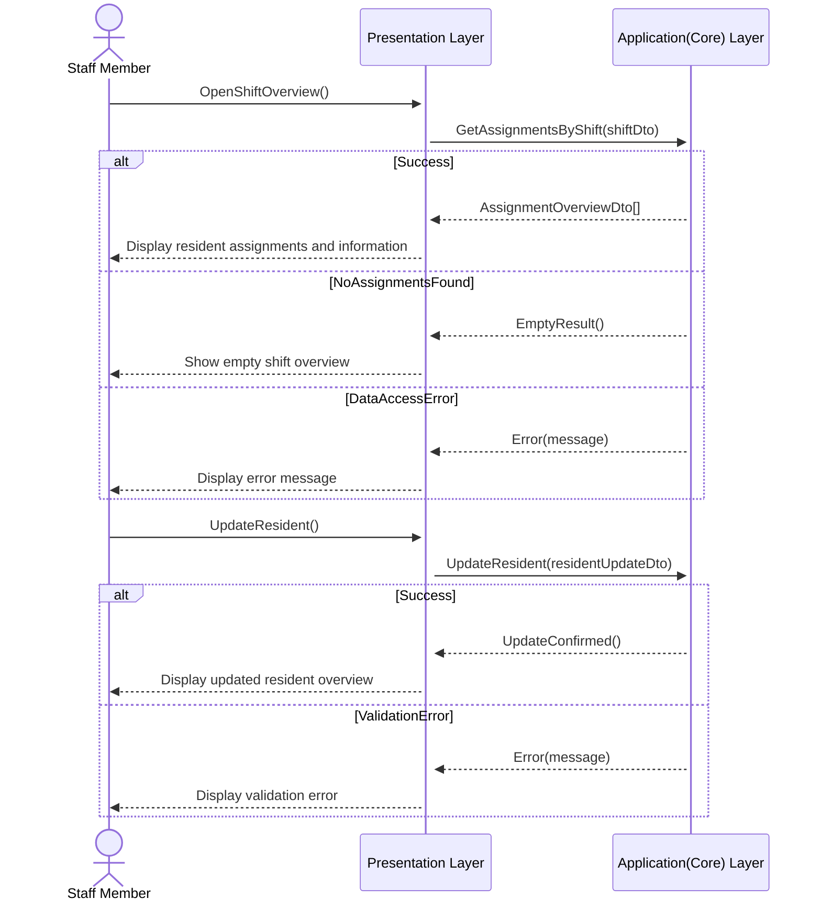
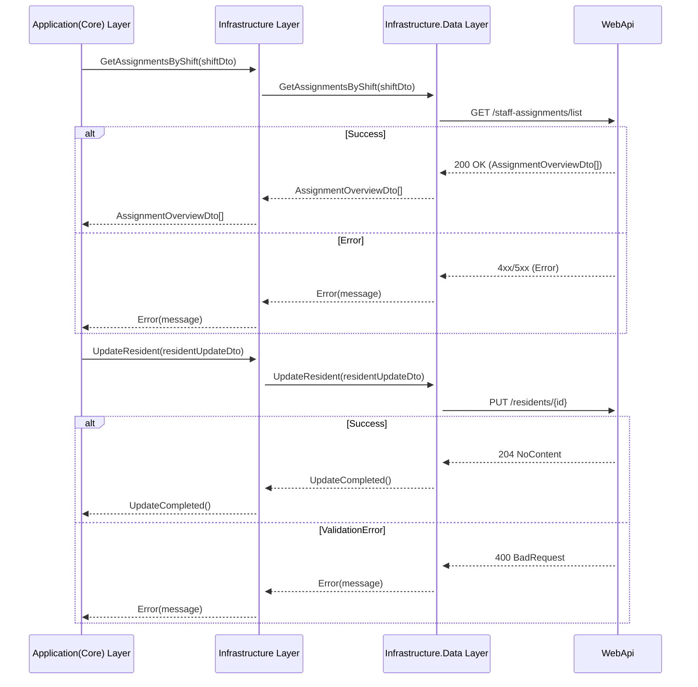

# Sequence Diagram – Shift Change and Citizen Status Update

## Description

Disse sekvensdiagrammer beskriver dataflowet ved et vagtskifte  og opdaterer en borger/beboerstatus i systemet.

Diagrammerne viser, hvordan frontend, API, tjenester, repositories og database interagerer under processen.

Flowet følger den systemarkitektur, der blev anvendt i projektet:
- Blazor WebUI frontend
- ASP.NET Core API-controllere
- Servicelag
- Repository/Datalag
- MySQL-database med Entity Framework Core

---

## Mermaid Sequence Diagram -Shift Flow

## Presentation → Application

```mermaid
sequenceDiagram
    actor StaffMember as Staff Member

    participant PresentationLayer as Presentation Layer
    participant ApplicationLayer as Application(Core) Layer

    %% LOAD SHIFT OVERVIEW
    StaffMember->>+PresentationLayer: OpenShiftOverview()

    PresentationLayer->>+ApplicationLayer: GetAssignmentsByShift(shiftDto)

    alt Success
        ApplicationLayer-->>PresentationLayer: AssignmentOverviewDto[]

        PresentationLayer-->>StaffMember: Display resident assignments and information

    else NoAssignmentsFound
        ApplicationLayer-->>PresentationLayer: EmptyResult()

        PresentationLayer-->>StaffMember: Show empty shift overview

    else DataAccessError
        ApplicationLayer-->>PresentationLayer: Error(message)

        PresentationLayer-->>StaffMember: Display error message
    end

    %% UPDATE RESIDENT INFORMATION
    StaffMember->>+PresentationLayer: UpdateResident()

    PresentationLayer->>+ApplicationLayer: UpdateResident(residentUpdateDto)

    alt Success
        ApplicationLayer-->>PresentationLayer: UpdateConfirmed()

        PresentationLayer-->>StaffMember: Display updated resident overview

    else ValidationError
        ApplicationLayer-->>PresentationLayer: Error(message)

        PresentationLayer-->>StaffMember: Display validation error
    end
   
```

### WebApi Layer → Infrastructure Layer (Data Access)

```mermaid
sequenceDiagram
    participant ApplicationLayer as Application(Core) Layer
    participant InfrastructureLayer as Infrastructure Layer
    participant InfrastructureDataLayer as Infrastructure.Data Layer
    participant WebApi

    %% LOAD SHIFT OVERVIEW
    ApplicationLayer->>+InfrastructureLayer: GetAssignmentsByShift(shiftDto)

    InfrastructureLayer->>+InfrastructureDataLayer: GetAssignmentsByShift(shiftDto)

    InfrastructureDataLayer->>+WebApi: GET /staff-assignments/list

    alt Success
        WebApi-->>InfrastructureDataLayer: 200 OK (AssignmentOverviewDto[])

        InfrastructureDataLayer-->>InfrastructureLayer: AssignmentOverviewDto[]

        InfrastructureLayer-->>ApplicationLayer: AssignmentOverviewDto[]

    else Error
        WebApi-->>InfrastructureDataLayer: 4xx/5xx (Error)

        InfrastructureDataLayer-->>InfrastructureLayer: Error(message)

        InfrastructureLayer-->>ApplicationLayer: Error(message)
    end

    %% UPDATE RESIDENT INFORMATION
    ApplicationLayer->>+InfrastructureLayer: UpdateResident(residentUpdateDto)

    InfrastructureLayer->>+InfrastructureDataLayer: UpdateResident(residentUpdateDto)

    InfrastructureDataLayer->>+WebApi: PUT /residents/{id}

    alt Success
        WebApi-->>InfrastructureDataLayer: 204 NoContent

        InfrastructureDataLayer-->>InfrastructureLayer: UpdateCompleted()

        InfrastructureLayer-->>ApplicationLayer: UpdateCompleted()

    else ValidationError
        WebApi-->>InfrastructureDataLayer: 400 BadRequest

        InfrastructureDataLayer-->>InfrastructureLayer: Error(message)

        InfrastructureLayer-->>ApplicationLayer: Error(message)
    end
```
---

## Notes
- Scope: dataflow ved vagtskifte samt opdatering af borgerinformation i systemet.
- Presentation Layer håndterer visning af vagtoversigt og residentinformation.
- Application Layer behandler assignment-data og residentopdateringer.
- WebApi-laget eksponerer endpoints til hentning og opdatering af data.
- Infrastruktur- og data lag håndterer persistence og kommunikation med databasen.
- DTO er anvendes til dataoverførsel mellem arkitekturens lag.

## Compliance
- Følger Clean Architecture-principper.
- Benytter Mermaid sequence diagrams.
- Følger projektets dokumentationsstruktur.
- Versionslog vedligeholdes.
