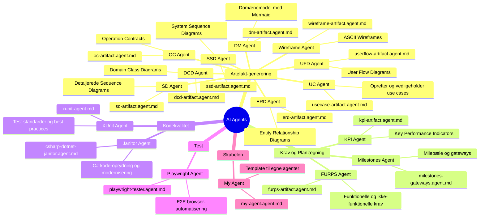
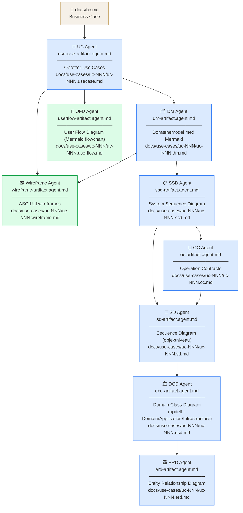
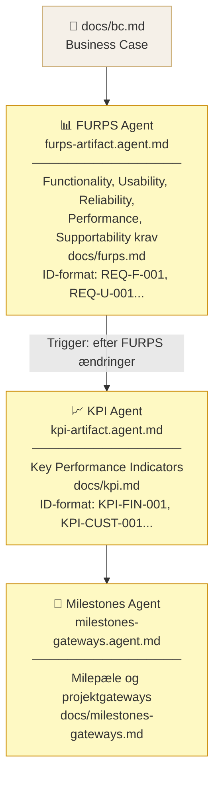
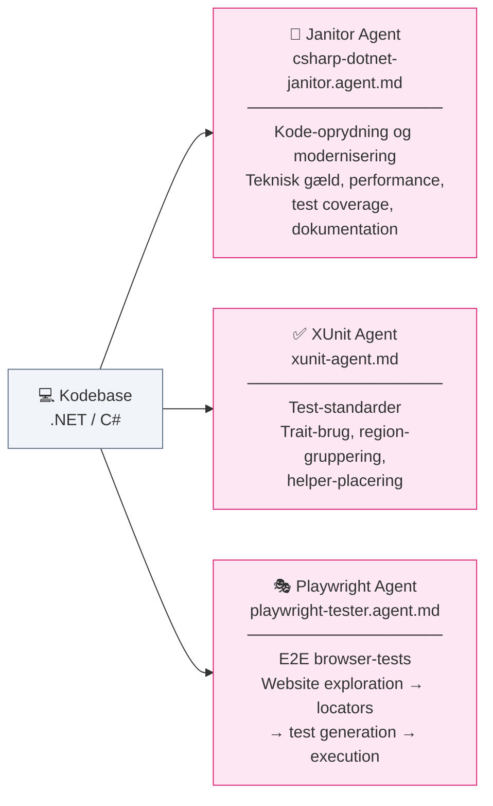
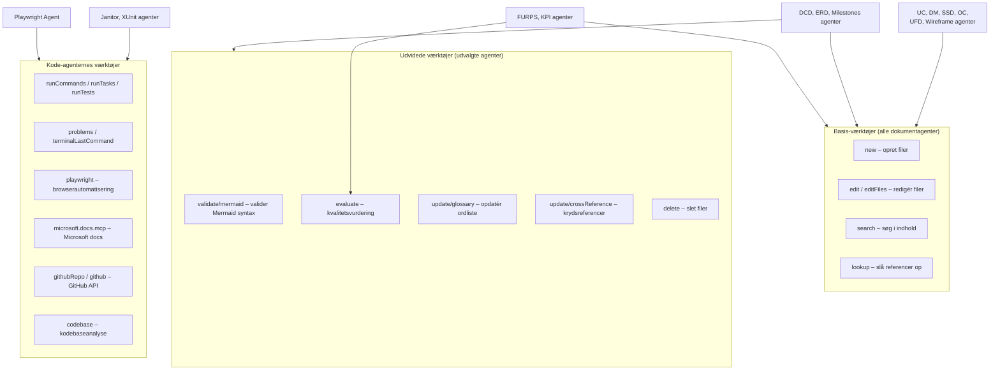
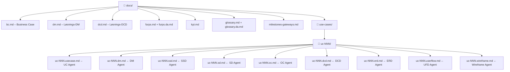
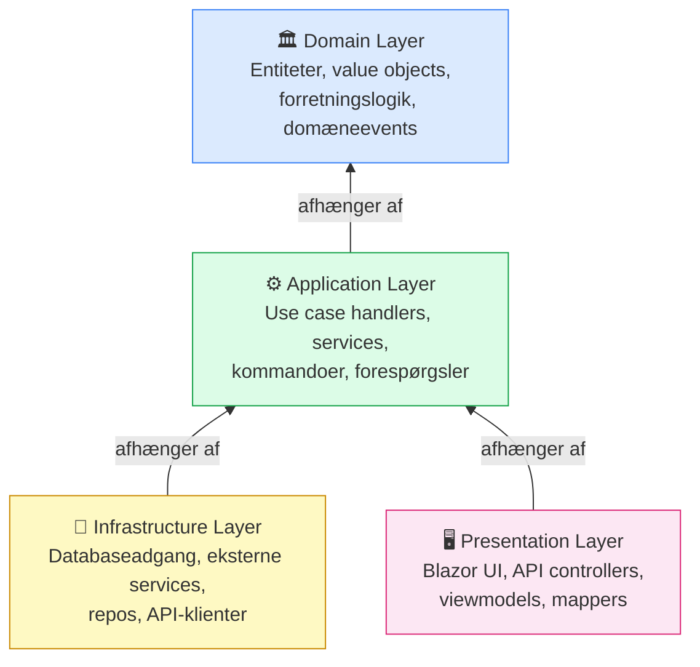

# AI Agents – Overblik og Flowdiagram

Dette dokument giver et visuelt overblik over alle AI-agenter i projektet, deres ansvarsområder og den måde de arbejder sammen på.

---

## 1. Mindmap – Alle agenter



---

## 2. Primær pipeline – Artefaktgenerering



---

## 3. Krav og planlægnings-pipeline



---

## 4. Kodekvalitets- og testpipeline



---

## 5. Agenternes værktøjsadgang



---

## 6. Filstruktur – genereret af agenter



---

## 7. Clean Architecture – håndhævet af SD og DCD agenter



> **Regel:** Afhængigheder peger altid indad. Domain Layer kender intet til Infrastructure eller Presentation.
```
