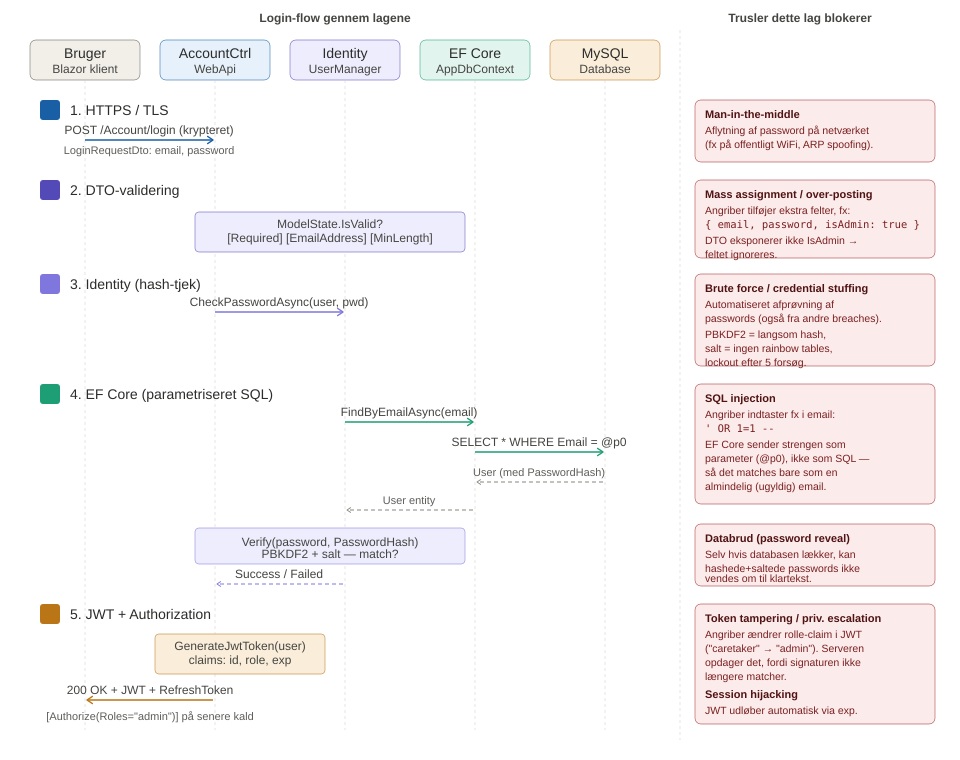
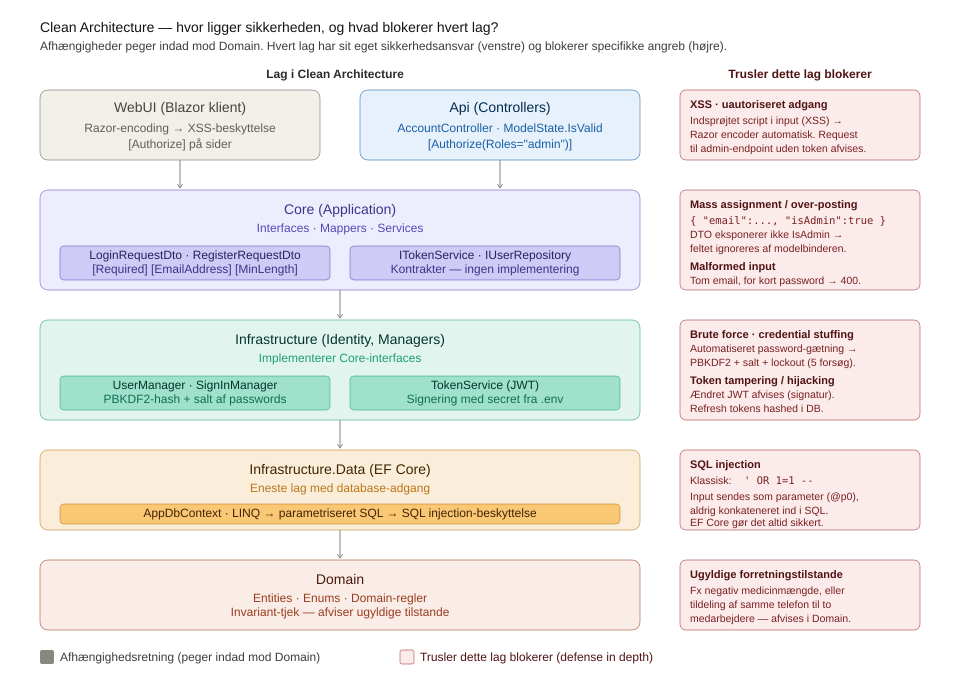

# Sikkerhedsovervejelser

Slottets Drifttavlen behandler følsomme personoplysninger om sårbare borgere — herunder helbredsobservationer og medicinhåndtering — og er derfor underlagt **GDPR artikel 9**. Sikkerhed og *privacy by design* er bygget ind i selve arkitekturen frem for tilføjet som et ekstra lag.

## Autentificering og adgangskontrol

Systemet anvender **ASP.NET Core Identity** som autentificeringsramme (jf. *ADR-0003*). Adgangskoder hashes med Identitys standardalgoritme (**PBKDF2**) og lagres aldrig i klartekst, og der håndhæves **password-kompleksitet** (mindst 7 tegn med store/små bogstaver, ciffer og specialtegn). Konti låses automatisk efter **5 mislykkede forsøg i 5 minutter**, hvilket bremser brute force-angreb. Login sker via `AccountController.Login`, som validerer credentials og udsteder en **JWT access token** sammen med en **refresh token**; refresh tokens lagres hashet, så de ikke kan misbruges, selv hvis databasen kompromitteres. JWT'en valideres på *issuer, audience, levetid og signaturnøgle* uden clock skew. Adgangskontrollen er rollebaseret via `[Authorize(Roles = "admin")]` på følsomme endpoints — fx er oprettelse og sletning af brugere samt anonymisering forbeholdt admin-rollen.

## Inputvalidering og beskyttelse mod injection

Al kommunikation mellem klient og API foregår gennem **DTOs** i Core-laget, som validerer input med DataAnnotations (`[Required]`, `[EmailAddress]`, `[MinLength]`). Controllerne afviser ugyldige requests med `ModelState.IsValid`, før data når forretningslogikken. DTO-mønsteret beskytter samtidig mod **mass assignment**, da klienten kun kan sætte eksplicit eksponerede felter — en bruger kan fx ikke selv tildele sig admin-rollen. Al databaseadgang sker udelukkende gennem **Entity Framework Core** i Infrastructure-laget, som genererer parametriserede SQL-statements via LINQ og dermed eliminerer **SQL injection**. *Clean Architecture* håndhæver, at intet andet lag har direkte databaseadgang.

## Kryptering og hemmeligheder

Kommunikation mellem WebUI, WebApi og klient skal i produktion foregå over **HTTPS/TLS** (redirect aktiveres ved idriftsættelse). Database-credentials og JWT signing keys ligger i en `.env`-fil uden for versionskontrol og injiceres som miljøvariabler via Docker Compose — `appsettings.json` indeholder kun placeholders, så *hemmeligheder aldrig eksisterer i Git-historikken*. Output i Blazor encodes automatisk i Razor-templates, hvilket forhindrer **cross-site scripting (XSS)**.

## Sporbarhed og GDPR-mekanismer (implementeret)

En **audit-interceptor** logger automatisk alle dataændringer ved `SaveChanges` (sporbarhed jf. *GDPR art. 5*), og audit-historikken kan kun læses af autentificerede brugere. Alle login-forsøg (succes og fejl, inkl. IP) registreres, og en **incident-detektionsservice** analyserer dem for brute force og adgang uden for normal arbejdstid. Systemet understøtter desuden **automatisk dataopbevaring/sletning** (retention) samt **indsigtsanmodninger** (*art. 15*) og **anonymisering**.

## Diagrammer

### Sikkerhedslag i login-flow

Diagrammet viser hvordan en login-request passerer gennem fem sikkerhedslag i kronologisk rækkefølge, og hvilke konkrete trusler hvert lag blokerer (*defense in depth*).

### Sikkerhedskomponenter i Clean Architecture

Diagrammet viser hvor i kodebasen hvert sikkerhedsansvar er placeret. Afhængighederne peger indad mod Domain, og hvert lag blokerer specifikke angreb.

## Forbedringsforslag (produktionsversion)

- **Tvungen HTTPS-redirect** og en strammere **CORS-politik** (i dag tillades alle origins)
- **To-faktor-autentificering (2FA)** for admin-roller
- **Kryptering at rest** af særligt følsomme felter i databasen
- **Automatisk scanning** af NuGet-afhængigheder for kendte sårbarheder
- **Penetrationstest** før idriftsættelse
