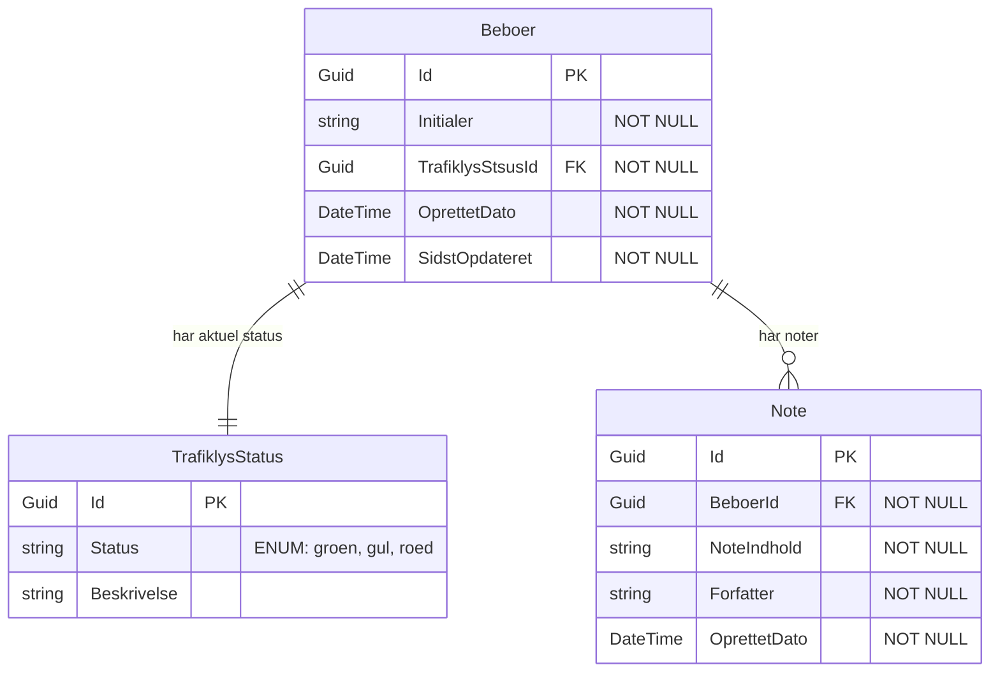

# Entity Relationship Diagram: Use Case 001 - Resident Dashboard

## Metadata
| Key               | Value                             |
|-------------------|-----------------------------------|
| Id                | ERD-UC-001                        |
| crossReference    | DM-0001, UC-001                   |

## Version
- **Version**: 0001
- **Date**: 2026-02-25

## Version Log
| Version | Date       | Description              | Author     |
|---------|------------|--------------------------|------------|
| 0001    | 2026-02-25 | Initial ERD for UC-001   | Team 6     |

## Entity Relationship Diagram

## Design Beslutninger

### Entities
1. **Beboer**: Repræsenterer en beboer på Slottet
   - `Initialer`: Kun ét bogstav (GDPR-compliant anonymitet)
   - `TrafiklysStsusId`: Foreign key til aktuel trafiklysstatus

2. **TrafiklysStatus**: Lookup table for trafiklysstatus
   - `Status`: ENUM med værdier: grøn, gul, rød
   - Pre-populated med tre rækker

3. **Note**: Repræsenterer noter tilknyttet en beboer
   - `Forfatter`: Medarbejder der oprettede noten
   - `OprettetDato`: Timestamp for sporbarhed

### Relationer
- **Beboer ↔ TrafiklysStatus**: One-to-one (hver beboer har præcis én aktuel status)
- **Beboer ↔ Note**: One-to-many (en beboer kan have mange noter)

### GDPR Overvejelser
- Kun initialer gemmes (ikke fulde navne)
- Noter indeholder minimal personhenførbar information
- Tidsstempler sikrer sporbarhed for audit trail

## Mapping fra Domain Model til ERD

| Domain Model Concept | ERD Entity        | Bemærkninger                          |
|----------------------|-------------------|---------------------------------------|
| Beboer               | Beboer            | Direkte mapping                       |
| Trafiklys            | TrafiklysStatus   | Omdøbt til Status (lookup table)      |
| Noter                | Note              | Singular form, tilføjet timestamps    |

## Næste Skridt
- Implementer database migration scripts
- Opret Entity Framework Core entities i Domain layer
- Implementer repository pattern i Infrastructure layer
