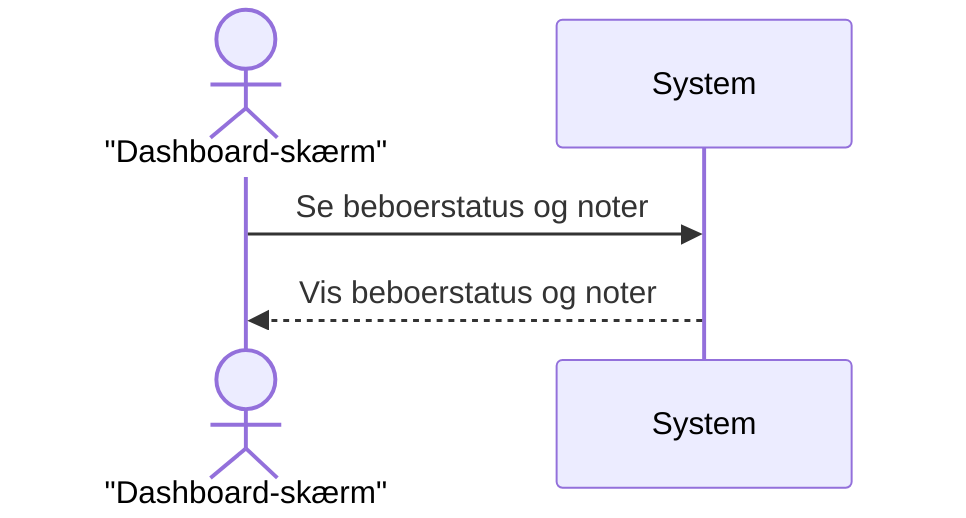

## Metadata
| Key            | Value                        |
|----------------|------------------------------|
| Id             | SSD-001                      |
| crossReference | UC-001                       |

## Version Log
| Version | Date       | Description              | Author     |
|---------|------------|--------------------------|------------|
| 0001    | 2026-02-25 | Initial                  | Team 6     |
| 0002    | 2026-02-28 | Updated with feedback    | Team 6     |

## System Sequence Diagram
<!-- System Sequence Diagram Template: All indhold under denne sektion er på dansk. -->

## Noter
- Dashboard-skærmen er hovedgrænsefladen for personalet til at se beboerinformation.
- Systemet henter og viser beboerens trafiklysstatus og eventuelle tilknyttede noter, når en tidsbegivenhed opstår (f.eks. hvert minut).
