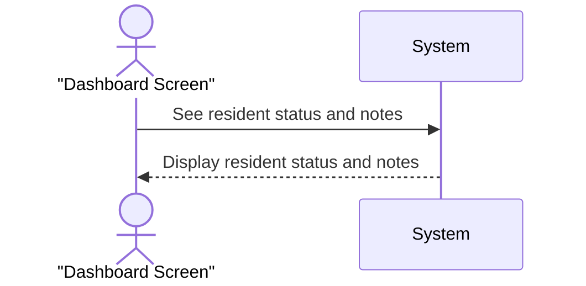

## Metadata
| Key            | Value                        |
|----------------|------------------------------|
| Id             | SSD-001                      |
| crossReference | UC-001                       |

## Version Log
| Version | Date       | Description              | Author     |
|---------|------------|--------------------------|------------|
| 0001    | 2026-02-25 | Initial                  | Team 6     |
| 0002    | 2026-02-28 | Updated with feedback    | Team 6     |

## System Sequence Diagram
<!-- System Sequence Diagram Template: Replace all [Insert ...] placeholders with project-specific content. -->

## Notes
- The dashbourd screen is the main interface for staff to view resident information.
- The system retrieves and displays the resident's traffic light status and any associated notes wheb a time event occurs (e.g., every minute).
