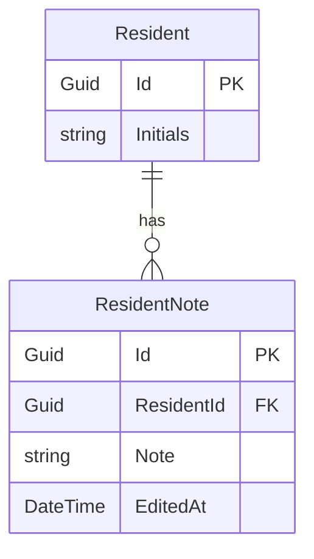

# Entity Relationship Diagram (ERD) for UC-002 Dashboard ResidentNote
## Metadata
| Key               | Value                             |
|-------------------|-----------------------------------|
| Id                | ERD-002                           |
| crossReference    | DCD-002                           |

## Version Log
| Version | Date       | Description                                       | Author |
|---------|------------|---------------------------------------------------|--------|
| 0001    | 2026-03-06 | Initial                                           | Team 6 |
| 0002    | 2026-05-04 | Align with DCD-002; remove non-persistent classes | Team 6 |

## Entity Relationship Diagram

**Notes:**
- Only persistent entities are shown — DTOs, services, controllers, managers and repositories belong in DCD-002.
- Attribute names align with DCD-002 (`Initials`, `Note`, `EditedAt`).
- Scope is limited to UC-002. See solution-level ERD (`docs/erd.md`) for the complete database schema.
- See DCD-002 for application/infrastructure class details.
