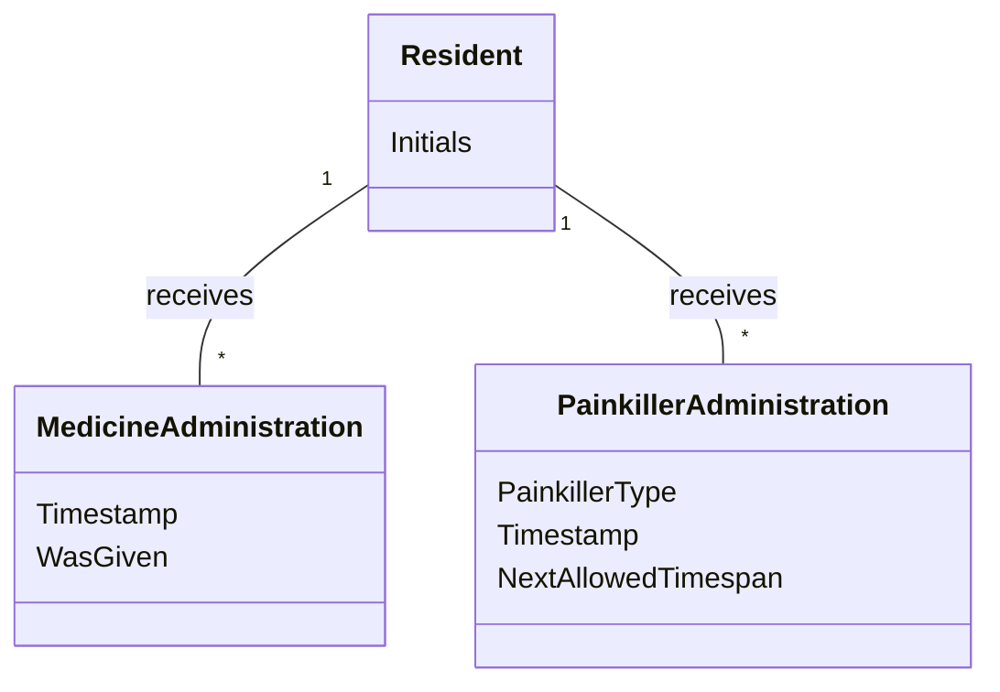

# Domain Model (DM) for UC-003 Medicine Status Dashboard
## Metadata
| Key               | Value                             |
|-------------------|-----------------------------------|
| Id                | UC-003.DM                         |
| crossReference    | UC-003                            |

## Version Log
| Version | Date       | Description              | Author     |
|---------|------------|--------------------------|------------|
| 0001    | 2026-03-19 | Initial                  | Team       |

## Domain Model Description
This domain model describes the entities and relationships required for the dashboard to display medicine status for all residents in the last 24 hours, including painkiller administration and next allowed timespan.

## Assumptions and Dependencies
- Each resident can have multiple medicine and painkiller administration records.
- Painkiller administration is a specialized case with type and next allowed timespan.
- Medicine and painkiller records are filtered to the last 24 hours for dashboard display.
- Medicine and painkiller records are filtered to the last 24 hours for dashboard display.

