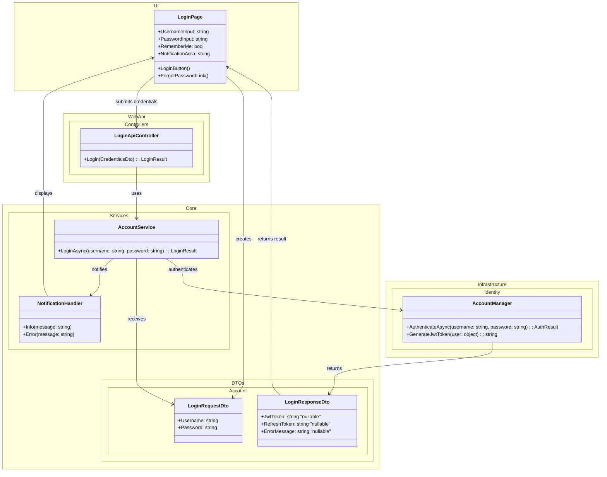

# Wireframe for Use Case 004: User Login
## Metadata
| Key               | Value                             |
|-------------------|-----------------------------------|
| Id                | UC-004.Wireframe                        |
| crossReference    | UC-004.DCD UC-004.OC UC-004.SD    |

## Version Log
| Version | Date       | Description              | Author     |
|---------|------------|--------------------------|------------|
| 0001    | 2026-05-03 | Initial                  | Team 6     |

---

---

## Notes
- UsernameInput and PasswordInput collect the login credentials.
- LoginButton submits the credentials for authentication.
- LoginRequestDto transfers username and password.
- LoginResponseDto returns tokens or an error message.
- NotificationHandler displays login success or failure feedback.

