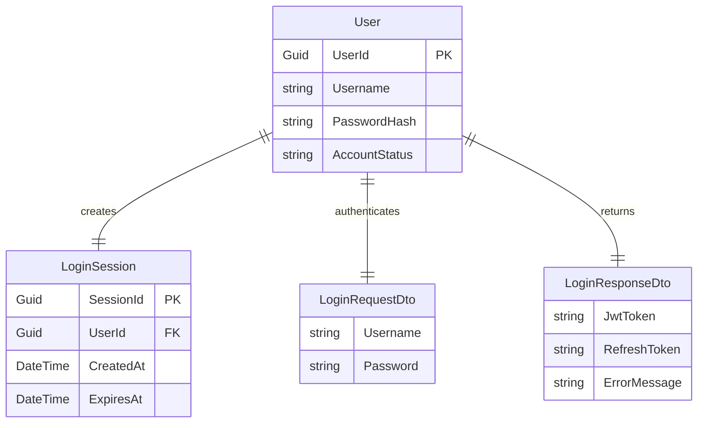

# Entity Relationship Diagram (ERD) for UC-004 User Login

## Metadata
| Key               | Value                             |
|-------------------|-----------------------------------|
| Id                | UC-004.ERD                          |
| crossReference    | UC-004.DCD                          |

## Version Log
| Version | Date       | Description | Author |
|---------|------------|-------------|--------|
| 0001    | 2026-05-04 | Initial     | Team 6 |

---

## Entity Relationship Diagram

## Notes
- All placeholders have been replaced with UC-004 specific content.
- Entities, attributes, and relationships are clearly defined.
- See DCD for domain class details.
- Only the latest version is kept in the main branch.

---

