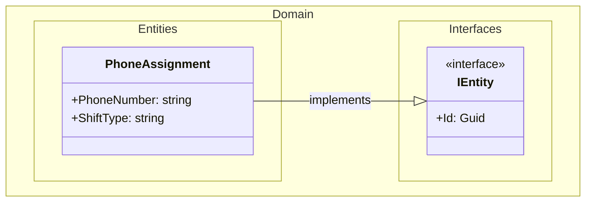
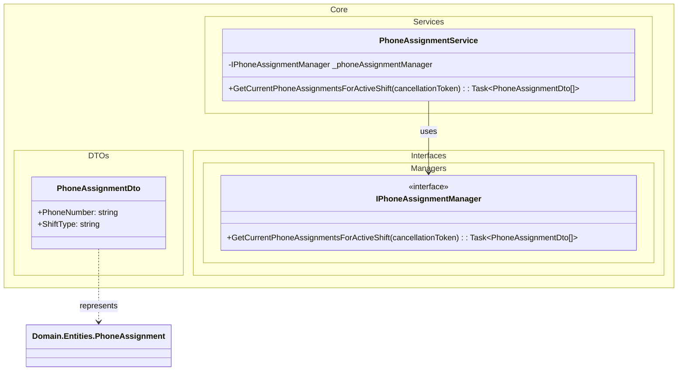
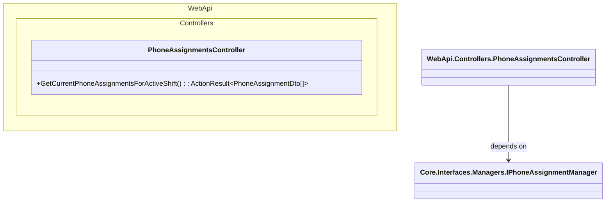

# Domain Class Diagram (DCD) for UC-005 Dashboard PhoneList

## Metadata
| Key            | Value                          |
|----------------|--------------------------------|
| Id             | UC-005.DCD                     |
| crossReference | UC-005.SD UC-005.SSD UC-005.OC |

## Version Log
| Version | Date       | Description                                           | Author |
|---------|------------|-------------------------------------------------------|--------|
| 0001    | 2026-04-04 | Initial DCD (WebApi controller depends on interface) | Team 6 |

---

## DCD for Domain Layer

---

## DCD for Core Layer

---

## DCD for Infrastructure Layer

---

## DCD for WebApi Layer

---

## Notes
- Clean Architecture dependency direction is preserved: WebApi depends on Core abstractions, and Infrastructure implements Core abstractions.
- The WebApi `PhoneAssignmentsController` must not reference `Infrastructure.Managers.PhoneAssignmentManager` directly.

## Language Handling
Professional English.
