```mermaid
%% DCD for Use Case 007: Authenticate to Access Data
classDiagram
  direction TB

  namespace Core.DTOs.Identity {
    class LoginRequestDto {
      +string Email
      +string Password
    }
    class LoginResponseDto {
      +string Token
      +string RefreshToken
      +DateTime ExpiresAt
    }
    class RefreshTokenRequestDto {
      +string RefreshToken
    }
    class LogoutRequestDto {
      +string RefreshToken
    }
  }

  namespace Core.Interfaces.Services {
    class IAccountService {
      <<interface>>
      +LoginAsync(LoginRequestDto) Task~ILoginResult~
      +RefreshAsync(RefreshTokenRequestDto) Task~LoginResponseDto~
      +LogoutAsync(LogoutRequestDto) Task~bool~
    }
    class ITokenService {
      <<interface>>
      +GenerateAccessToken(User, IEnumerable~string~ roles) string
      +GenerateRefreshToken() string
      +ValidateRefreshTokenAsync(string) Task~bool~
    }
  }

  namespace Core.Services {
    class AccountService {
      -ITokenService _tokenService
      -UserManager~User~ _userManager
      +LoginAsync(LoginRequestDto) Task~ILoginResult~
      +RefreshAsync(RefreshTokenRequestDto) Task~LoginResponseDto~
      +LogoutAsync(LogoutRequestDto) Task~bool~
    }
    class TokenService {
      -IConfiguration _config
      +GenerateAccessToken(User, IEnumerable~string~) string
      +GenerateRefreshToken() string
      +ValidateRefreshTokenAsync(string) Task~bool~
    }
  }

  namespace WebUI.Client.Services {
    class TokenStorageService {
      -ILocalStorageService _localStorage
      +SetTokenAsync(string accessToken, string refreshToken) Task
      +GetAccessTokenAsync() Task~string?~
      +GetRefreshTokenAsync() Task~string?~
      +RemoveTokenAsync() Task
    }
    class JwtAuthenticationStateProvider {
      <<extends AuthenticationStateProvider>>
      -TokenStorageService _tokenStorage
      +GetAuthenticationStateAsync() Task~AuthenticationState~
      +NotifyAuthenticationStateChanged() void
    }
    class AuthService {
      -TokenStorageService _tokenStorage
      -IAccountService _accountService
      +LoginAsync(string username, string password) Task~bool~
      +LogoutAsync() Task
    }
  }

  namespace WebUI.Client {
    class RedirectToLogin {
      <<Razor Component>>
      -NavigationManager _navigationManager
      +OnInitialized() void
    }
  }

  namespace Infrastructure.Managers {
    class JwtAuthorizationMessageHandler {
      <<extends DelegatingHandler>>
      -TokenStorageService _tokenStorage
      #SendAsync(HttpRequestMessage, CancellationToken) Task~HttpResponseMessage~
    }
  }

  namespace Infrastructure.Middleware {
    class JwtRefreshMiddleware {
      <<DelegatingHandler>>
      -TokenStorageService _tokenStorage
      -IAccountService _accountService
      #SendAsync(HttpRequestMessage, CancellationToken) Task~HttpResponseMessage~
    }
  }

  namespace Api.Controllers.Identity {
    class AccountController {
      <<ApiController>>
      -IAccountService _accountService
      +Login(LoginRequestDto) Task~IActionResult~
      +Refresh(RefreshTokenRequestDto) Task~IActionResult~
      +Logout(LogoutRequestDto) Task~IActionResult~
    }
  }

  namespace Api.Controllers {
    class ResourceAPIController {
      <<ApiController, [Authorize]>>
      +GetProtectedDataAsync() Task~IActionResult~
    }
  }

  %% Implementations
  AccountService ..|> IAccountService : implements
  TokenService ..|> ITokenService : implements

  %% Dependencies (delegation)
  AccountService --> ITokenService : uses
  AuthService --> IAccountService : uses
  AuthService --> TokenStorageService : uses
  JwtAuthenticationStateProvider --> TokenStorageService : reads from
  JwtAuthorizationMessageHandler --> TokenStorageService : reads token from
  JwtRefreshMiddleware --> TokenStorageService : reads/writes
  JwtRefreshMiddleware --> IAccountService : refresh on 401
  AccountController --> IAccountService : delegates to
  RedirectToLogin --> JwtAuthenticationStateProvider : reacts to

  %% DTO usage
  IAccountService --> LoginRequestDto : accepts
  IAccountService --> LoginResponseDto : returns
  IAccountService --> RefreshTokenRequestDto : accepts
  IAccountService --> LogoutRequestDto : accepts
  AccountController --> LoginRequestDto : binds from request body
  AccountController --> LoginResponseDto : serializes to response
```

# Domain Class Diagram (DCD) for Use Case 007: Authenticate to Access Data

## Metadata
| Key               | Value                                                |
|-------------------|------------------------------------------------------|
| Id                | UC-007.DCD                                           |
| crossReference    | UC-007.SD UC-007.OC UC-007.DM UC-007.ERD    |

## Version Log
| Version | Date       | Description                                                                  | Author |
|---------|------------|------------------------------------------------------------------------------|--------|
| 0001    | 2026-05-10 | Initial — token domain, refresh middleware, and authorization classes        | Team 6 |

---

---

## Notes

### Architecture
- Strict Clean Architecture: Core defines all interfaces (`IAccountService`, `ITokenService`); WebUI.Client and Api consume them via DI.
- `JwtAuthorizationMessageHandler` and `JwtRefreshMiddleware` live in Infrastructure as `DelegatingHandler`s — they wrap `HttpClient` so token attachment and refresh are transparent to callers.
- Token persistence on the client is delegated to `TokenStorageService` (browser local storage); server-side persistence of issued refresh tokens is handled by ASP.NET Core Identity infrastructure (out of UC-007 scope).

### UC-007 authorize-on-request flow
- `JwtAuthorizationMessageHandler.SendAsync` reads the access token from `TokenStorageService` and attaches `Authorization: Bearer <token>` to every outgoing HTTP request before delegating to the next handler.
- `ResourceAPIController` (and any other protected controller) is decorated with `[Authorize]`. The ASP.NET Core authorization middleware validates the token signature and expiry; the framework returns 401 or 403 directly without entering the action method.
- The Time Event (UC-007.DM, UC-007.SSD) ultimately invokes the same `HttpClient` pipeline — the authorization flow is identical for user-initiated and system-initiated requests.

### UC-007 silent refresh flow (extension 3b)
- `JwtRefreshMiddleware.SendAsync` inspects every response. On 401, it reads the refresh token from `TokenStorageService` and calls `IAccountService.RefreshAsync` (which routes through `AccountController.Refresh` over HTTP).
- On a successful refresh, the new access token is written back to `TokenStorageService` and the original request is retried with the new token.
- On a failed refresh (extension 3c), the middleware calls `TokenStorageService.RemoveTokenAsync()` and triggers `RedirectToLogin` via `NavigationManager`.

### Alignment with UC-004 (User Login)
- The `LoginRequestDto`, `LoginResponseDto`, and `IAccountService.LoginAsync` types are introduced by UC-004; UC-007.DCD references them but does NOT redefine the login flow.
- UC-007 begins after UC-004 has produced an initial `(accessToken, refreshToken)` pair stored in `TokenStorageService`.

### Audit interaction (UC-009)
- Failed authorization attempts (401/403 from `ResourceAPIController`) are recorded in the audit trail by the existing `AuditInterceptor` from UC-009 backend (REQ-R-003). UC-007.DCD does not redefine the audit pipeline.

### Alignment with ERD
- UC-007 has no new persistent entities of its own — token persistence either lives in browser storage (client side) or in ASP.NET Core Identity's existing tables (server side). UC-007.ERD will document the Identity tables that participate in token issuance and refresh.
