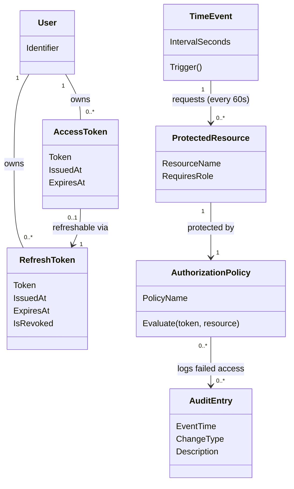

# Domænemodel (DM) for Autentificér for at få adgang til data

## Metadata
| Nøgle               | Værdi                             |
|---------------------|-----------------------------------|
| Id                  | UC-007.DM                         |
| crossReference      | BC UC-007 UC-004 REQ-F-005 REQ-DC-001 REQ-R-003 |

## Versionslog
| Version | Dato       | Beskrivelse              | Forfatter |
|---------|------------|--------------------------|----------|
| 0001    | 2026-05-10 | Initial                  | Team 6   |

## Diagram

## Antagelser og Afhængigheder
- `AccessToken` (JWT) er kortlivet (typisk 15 min) og bruges som Bearer token i hver forespørgsel til en `ProtectedResource`.
- `RefreshToken` er langlivet og bruges til stille og roligt at hente et nyt `AccessToken`, når det nuværende udløber.
- `TimeEvent` er en systemaktør: den kræver ikke brugerinteraktion, men skal stadig medbringe et gyldigt `AccessToken` ved hver periodisk genindlæsning.
- Alle `ProtectedResource`-endpoints i Resource API’et er dekoreret med `[Authorize]`; `AuthorizationPolicy` håndhæves af ASP.NET Core middleware.
- Mislykkede `AuthorizationPolicy`-evalueringer opretter `AuditEntry`-registreringer (REQ-R-003); vellykkede evalueringer kan også logges afhængigt af konfiguration.
- Login i sig selv (legitimationsoplysninger -> initial `AccessToken` + `RefreshToken`) ejes af UC-004, ikke UC-007.

## Termoversættelse

| Original Term         | Dansk Oversættelse               |
|----------------------|----------------------------------|
| AccessToken          | Adgangstoken                     |
| RefreshToken         | Fornyelsestoken                  |
| TimeEvent            | Tidshændelse                     |
| ProtectedResource    | Beskyttet ressource              |
| AuthorizationPolicy  | Autorisationsregel               |
| IssuedAt             | Udstedt                          |
| ExpiresAt            | Udløber                          |
| IsRevoked            | ErTilbagekaldt                   |
| IntervalSeconds      | Intervalsekunder                 |
| Trigger              | Udløs                            |
| ResourceName         | Ressourcenavn                    |
| RequiresRole         | KræverRolle                      |
| PolicyName           | Regelnavn                        |
| Evaluate             | Evaluér                          |
| Identifier           | Identifikator                    |
| Bearer token         | Bærer-token                      |

## Noter
- Login-domænet (Caregiver, AuthenticationSystem, Session) ejes af UC-004 — denne DM refererer kun til `User` som en passiv klasse for ejerskab af tokens.
- `AccessToken` udstedes af Identity API (efter UC-004 login eller efter fornyelse). Rotation af RefreshToken anbefales ved hver fornyelse (sikkerhedsmæssig best practice).
- `TimeEvent` repræsenterer drifttavlens auto-opdatering — det er en systemaktør i use casen, men fungerer som initiator af klientforespørgsler på domæneniveau.
- `AuditEntry`-referencen matcher UC-009’s domænemodel; UC-007 tilføjer kun registreringer ved mislykket autorisation, og ejer ikke AuditLog-aggregatet.
