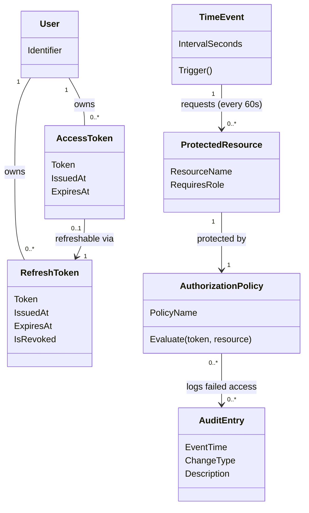

# Domain Model (DM) for Authenticate to access data

## Metadata
| Key               | Value                             |
|-------------------|-----------------------------------|
| Id                | UC-007.DM                         |
| crossReference    | BC UC-007 UC-004 REQ-F-005 REQ-DC-001 REQ-R-003 |

## Version Log
| Version | Date       | Description              | Author     |
|---------|------------|--------------------------|------------|
| 0001    | 2026-05-10 | Initial                  | Team 6     |

## Diagram

## Assumptions and Dependencies
- `AccessToken` (JWT) is short-lived (typically 15 min) and used as a Bearer token in every request to a `ProtectedResource`.
- `RefreshToken` is long-lived and used to silently obtain a new `AccessToken` when the current one expires.
- The `TimeEvent` is a system actor: it does not require user interaction but still must carry a valid `AccessToken` on each periodic re-fetch.
- All `ProtectedResource` endpoints in the Resource API are decorated with `[Authorize]`; `AuthorizationPolicy` is enforced by ASP.NET Core middleware.
- Failed `AuthorizationPolicy` evaluations create `AuditEntry` records (REQ-R-003); successful evaluations may also be logged based on configuration.
- Login itself (credentials -> initial `AccessToken` + `RefreshToken`) is owned by UC-004, not UC-007.

## Terms Translation

| Original Term         | Danish Translation                |
|----------------------|-----------------------------------|
| AccessToken          | Adgangstoken                      |
| RefreshToken         | Fornyelsestoken                   |
| TimeEvent            | Tidshændelse                      |
| ProtectedResource    | Beskyttet ressource               |
| AuthorizationPolicy  | Autorisationsregel                |
| IssuedAt             | Udstedt                           |
| ExpiresAt            | Udløber                           |
| IsRevoked            | ErTilbagekaldt                    |
| IntervalSeconds      | Intervalsekunder                  |
| Trigger              | Udløs                             |
| ResourceName         | Ressourcenavn                     |
| RequiresRole         | KræverRolle                       |
| PolicyName           | Regelnavn                         |
| Evaluate             | Evaluér                           |
| Identifier           | Identifikator                     |
| Bearer token         | Bærer-token                       |

## Notes
- Login domain (Caregiver, AuthenticationSystem, Session) is owned by UC-004 — this DM only references `User` as a passive class for ownership of tokens.
- `AccessToken` is issued by Identity API (after UC-004 login or after refresh). RefreshToken rotation is recommended on each refresh (security best practice).
- `TimeEvent` represents the Dashboard's auto-refresh — it is a system actor in the use case but acts as a client request initiator at the domain level.
- `AuditEntry` reference matches UC-009's domain model; UC-007 only adds records via failed authorization, it does not own the AuditLog aggregate.
