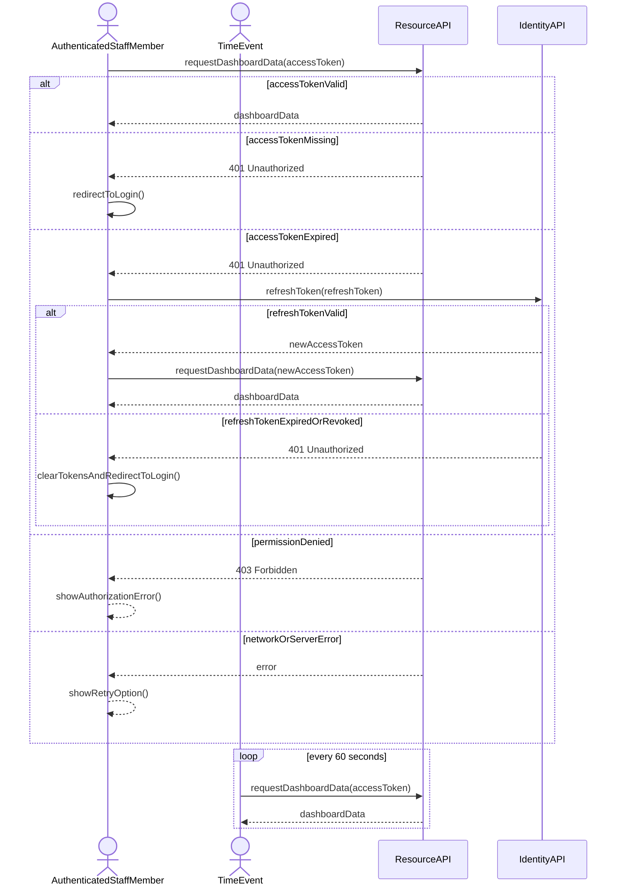

# Operationskontrakt: Autentificér for at få adgang til data

## Metadata
| Nøgle           | Værdi                              |
|-----------------|------------------------------------|
| Id              | UC-007.OC                          |
| crossReference  | UC-007.SSD UC-007.DM UC-007.UC     |

## Versionslog
| Version | Dato       | Beskrivelse | Forfatter |
|---------|------------|-------------|-----------|
| 0001    | 2026-05-10 | Initial     | Team 6    |

## Operationskontrakt

### Anmod om Dashboard-data
- **Forudsætninger**:
  - AuthenticatedStaffMember har gennemført UC-004 login.
  - Klienten har et AccessToken (muligvis udløbet) og et RefreshToken i TokenStorageService.
  - ResourceAPI er tilgængelig.
- **Efterbetingelser**:
  - Ved succes (gyldigt token): ResourceAPI returnerer de anmodede Dashboard-data.
  - Ved accessTokenMissing (3a): ResourceAPI returnerer 401 Unauthorized; klienten viderestiller til login via RedirectToLogin.
  - Ved accessTokenExpired (3b): ResourceAPI returnerer 401 Unauthorized; klienten udløser Forny adgangstoken og forsøger derefter igen med det nye token.
  - Ved permissionDenied (4a): ResourceAPI returnerer 403 Forbidden; klienten viser en autorisationsfejl.
  - Ved networkOrServerError (5a): klienten viser en fejl med mulighed for at prøve igen.
  - Mislykkede autorisationer registreres i audit trail (REQ-R-003).

### Forny adgangstoken
- **Forudsætninger**:
  - Klienten har et ikke-tilbagekaldt, ikke-udløbet RefreshToken i TokenStorageService.
  - IdentityAPI er tilgængelig.
- **Efterbetingelser**:
  - Ved succes: IdentityAPI udsteder et nyt AccessToken; klienten gemmer det i TokenStorageService og gentager den oprindelige forespørgsel.
  - Ved refreshTokenExpiredOrRevoked (3c): IdentityAPI returnerer 401 Unauthorized; klienten rydder gemte tokens via TokenStorageService.RemoveTokenAsync() og viderestiller til login.

### Udløs periodisk genindlæsning (Tidshændelse)
- **Forudsætninger**:
  - Dashboard er indlæst med gyldige tokens i TokenStorageService.
  - 60-sekunders interval er forløbet siden sidste hentning.
- **Efterbetingelser**:
  - TimeEvent kalder Anmod om Dashboard-data med det aktuelle AccessToken; flowet fortsætter ifølge efterbetingelserne for Anmod om Dashboard-data.
  - Denne operation er system-initieret (ingen brugerinteraktion påkrævet), men er underlagt samme autorisationsregler som brugerinitierede forespørgsler.
