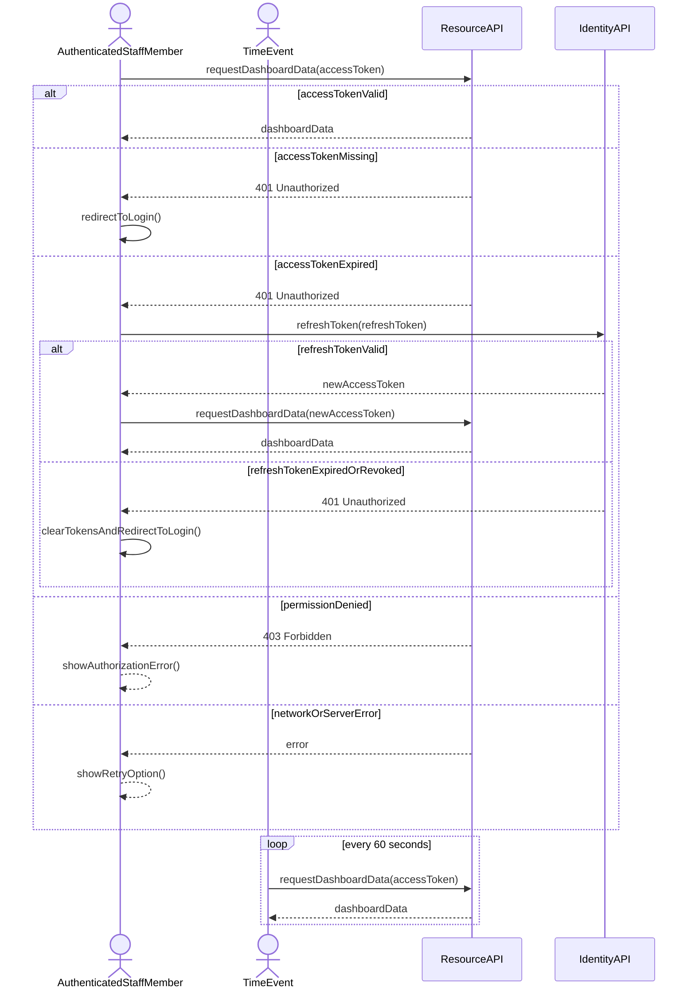

# Operation Contract: Authenticate to access data

## Metadata
| Key            | Value                              |
|----------------|------------------------------------|
| Id             | UC-007.OC                          |
| crossReference | UC-007.SSD UC-007.DM UC-007.UC     |

## Version Log
| Version | Date       | Description | Author |
|---------|------------|-------------|--------|
| 0001    | 2026-05-10 | Initial     | Team 6 |

## Operation Contract

### Request Dashboard Data
- **Preconditions**:
  - AuthenticatedStaffMember has completed UC-004 login.
  - Client holds an AccessToken (potentially expired) and a RefreshToken in TokenStorageService.
  - ResourceAPI is available.
- **Postconditions**:
  - On success (token valid): ResourceAPI returns the requested dashboard data.
  - On accessTokenMissing (3a): ResourceAPI returns 401 Unauthorized; client redirects to login via RedirectToLogin.
  - On accessTokenExpired (3b): ResourceAPI returns 401 Unauthorized; client triggers Refresh Access Token, then retries with the new token.
  - On permissionDenied (4a): ResourceAPI returns 403 Forbidden; client displays an authorization error.
  - On networkOrServerError (5a): client displays an error with a retry option.
  - Failed authorizations are recorded in the audit trail (REQ-R-003).

### Refresh Access Token
- **Preconditions**:
  - Client holds a non-revoked, non-expired RefreshToken in TokenStorageService.
  - IdentityAPI is available.
- **Postconditions**:
  - On success: IdentityAPI issues a new AccessToken; client stores it in TokenStorageService and retries the original request.
  - On refreshTokenExpiredOrRevoked (3c): IdentityAPI returns 401 Unauthorized; client clears stored tokens via TokenStorageService.RemoveTokenAsync() and redirects to login.

### Trigger Periodic Re-fetch (Time Event)
- **Preconditions**:
  - Dashboard is loaded with valid tokens in TokenStorageService.
  - 60-second interval has elapsed since the last fetch.
- **Postconditions**:
  - TimeEvent invokes Request Dashboard Data with the current AccessToken; flow continues per Request Dashboard Data postconditions.
  - This operation is system-initiated (no user interaction required) but inherits the same authorization rules as user-initiated requests.
