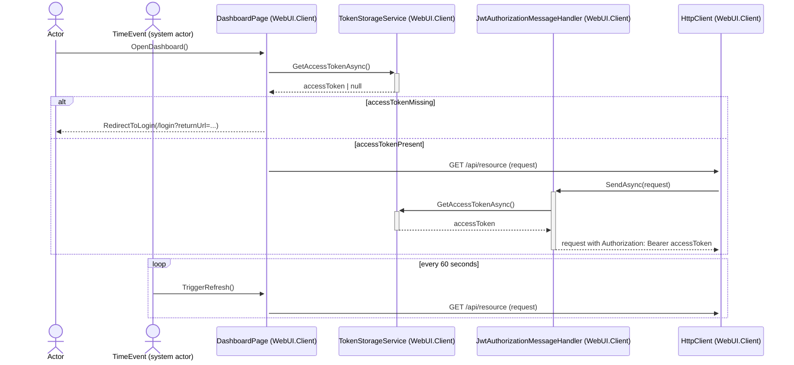
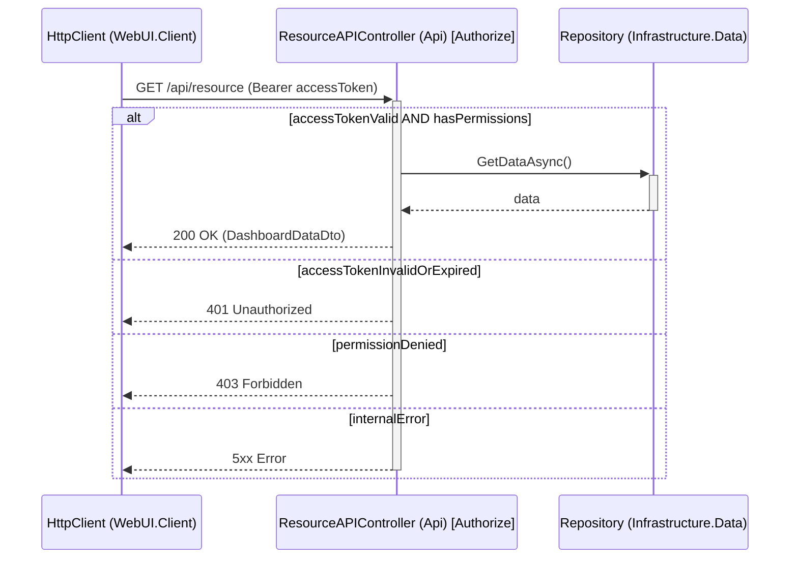
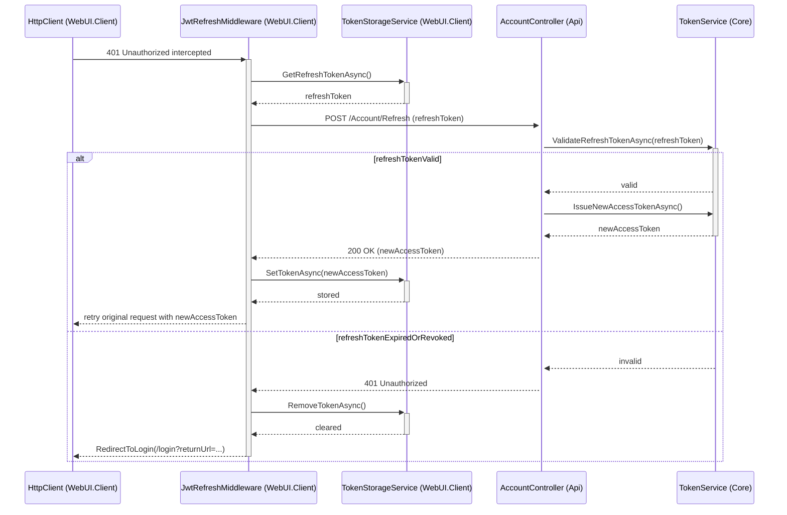

# UC-007 Authenticate to Access Data Sequence Diagram

## Metadata
| Key            | Value                              |
|----------------|------------------------------------|
| Id             | UC-007.SD                          |
| crossReference | UC-007.SSD UC-007.OC UC-007.DM     |

## Version Log
| Version | Date       | Description | Author |
|---------|------------|-------------|--------|
| 0001    | 2026-05-10 | Initial     | Team 6 |

## Sequence Diagram

### Presentation Layer → Application Layer

### WebUI.Client → WebApi (Resource API call with token)

### Refresh Flow (Identity API call when 401 received)

## Notes
- UC-007 enforces authorization on every Resource API request, including periodic re-fetches triggered by the Time Event (system actor).
- The `JwtAuthorizationMessageHandler` is a `DelegatingHandler` that automatically attaches the Bearer token to all outgoing requests.
- The `JwtRefreshMiddleware` intercepts 401 responses and silently refreshes the access token before retrying — extension 3b is invisible to the user.
- DTOs cross all layer boundaries (no entities exposed):
  - `DashboardDataDto`, `LoginRequestDto`, `LoginResponseDto`, `RefreshTokenRequestDto`
- Clean Architecture dependency direction is preserved: WebUI.Client → Core (interfaces) ← Infrastructure (implementations); Api → Infrastructure.Data (repositories).
- Failed authorization attempts (401/403) are recorded in the audit trail by the audit interceptor (UC-009 backend, REQ-R-003).
- Login itself (initial token issuance from credentials) is owned by UC-004 — UC-007.SD only covers the refresh flow on Identity API.
