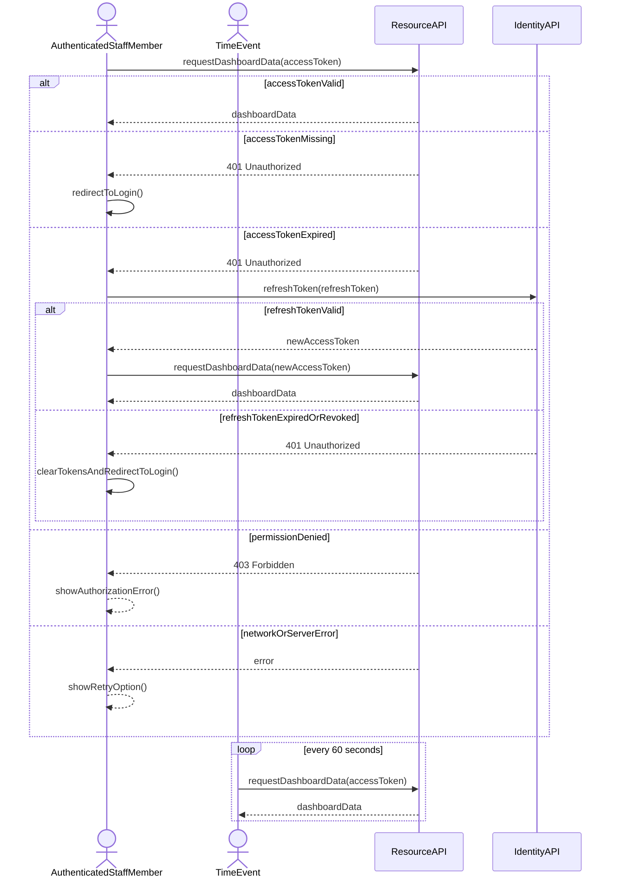

# Systemsekvensdiagram for Autentificér for at få adgang til data

## Metadata
| Nøgle           | Værdi                      |
|-----------------|----------------------------|
| Id              | UC-007.SSD                 |
| crossReference  | UC-007 UC-007.DM UC-007.UC |

## Versionslog
| Version | Dato       | Beskrivelse | Forfatter |
|---------|------------|-------------|-----------|
| 0001    | 2026-05-10 | Initial SSD | Team 6    |

## Systemsekvensdiagram

## Sprogoversættelse

| Original Term                   | Dansk Oversættelse              |
|--------------------------------|----------------------------------|
| AuthenticatedStaffMember       | Autentificeret medarbejder       |
| TimeEvent                      | Tidshændelse                     |
| ResourceAPI                    | Ressource-API                    |
| IdentityAPI                    | Identity-API                     |
| requestDashboardData           | anmodOmDashboardData             |
| accessToken                    | adgangstoken                     |
| refreshToken                   | fornyelsestoken                  |
| dashboardData                  | dashboardData                    |
| redirectToLogin                | viderestilTilLogin               |
| clearTokensAndRedirectToLogin  | rydTokensOgViderestilTilLogin     |
| showAuthorizationError         | visAutorisationsfejl             |
| showRetryOption                | visForsøgIgen                    |
| newAccessToken                 | nytAdgangstoken                  |
| 401 Unauthorized               | 401 Uautoriseret                 |
| 403 Forbidden                  | 403 Forbudt                      |
