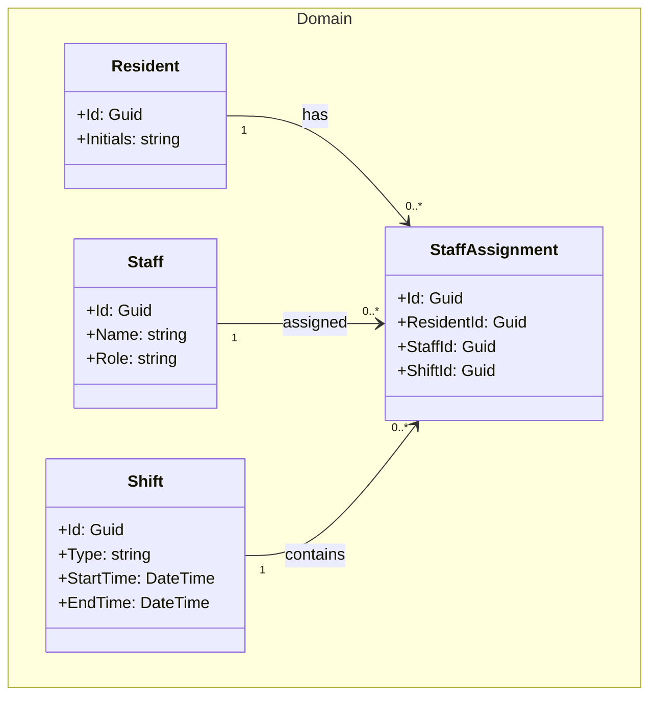
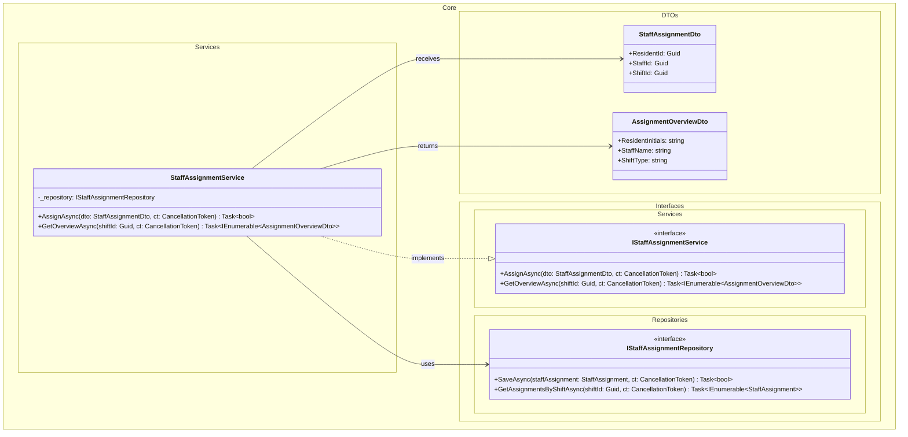
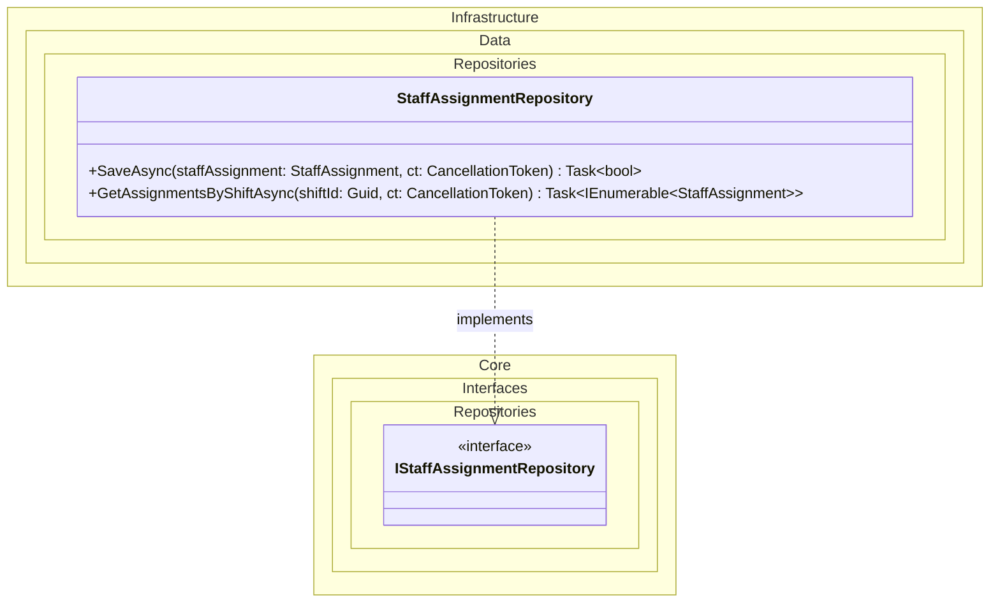
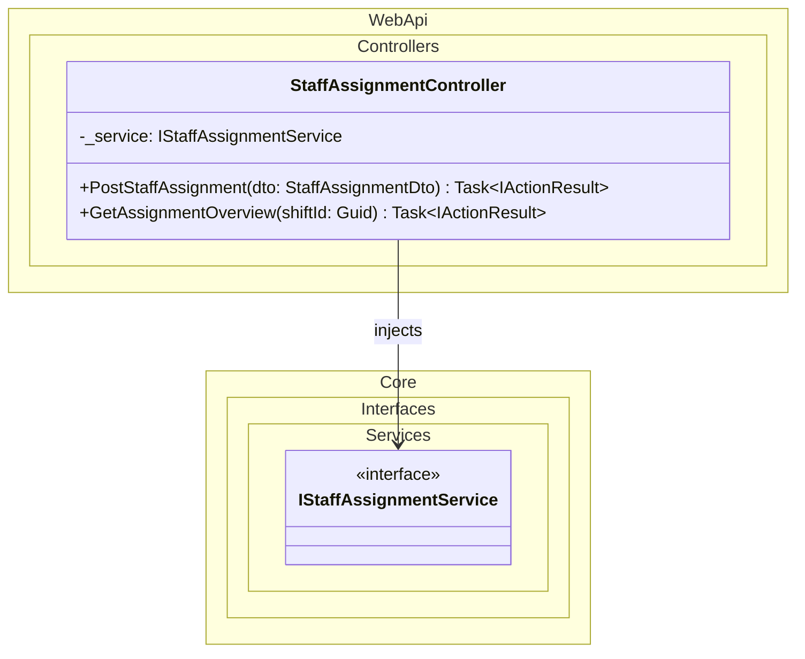
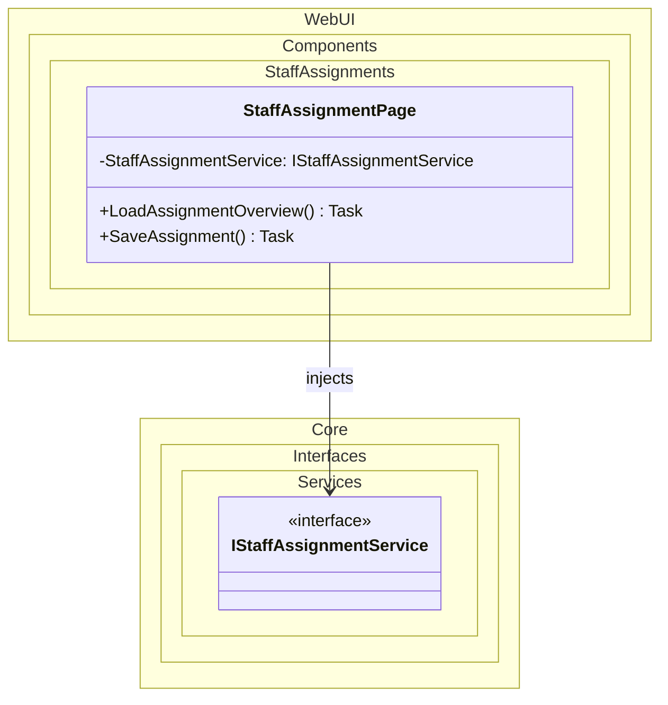

# Domain Class Diagram (DCD) for UC-008 Assign Staff to Residents

## Metadata
| Key               | Value                             |
|-------------------|-----------------------------------|
| Id                | DCD-008                           |
| crossReference    | SD-008                            |

## Version Log
| Version | Date       | Description          | Author |
|---------|------------|----------------------|--------|
| 0001    | 2026-05-06 | Initial              | Team 6 |

## Domain Class Diagram

### Domain Layer

### Application Layer

### Infrastructure Layer

### WebApi Layer

### WebUI Layer

## Notes
- StaffAssignmentPage uses IStaffAssignmentService to load and save assignment data.
- StaffAssignmentController exposes assignment endpoints to the WebUI.
- StaffAssignmentService handles validation and assignment rules.
- StaffAssignmentService uses IStaffAssignmentRepository to persist assignment data.
- StaffAssignmentRepository implements IStaffAssignmentRepository.
- DTOs are used for communication between layers.
- StaffAssignment connects Resident, Staff, and Shift.
- Dependencies point inward following Clean Architecture principles.