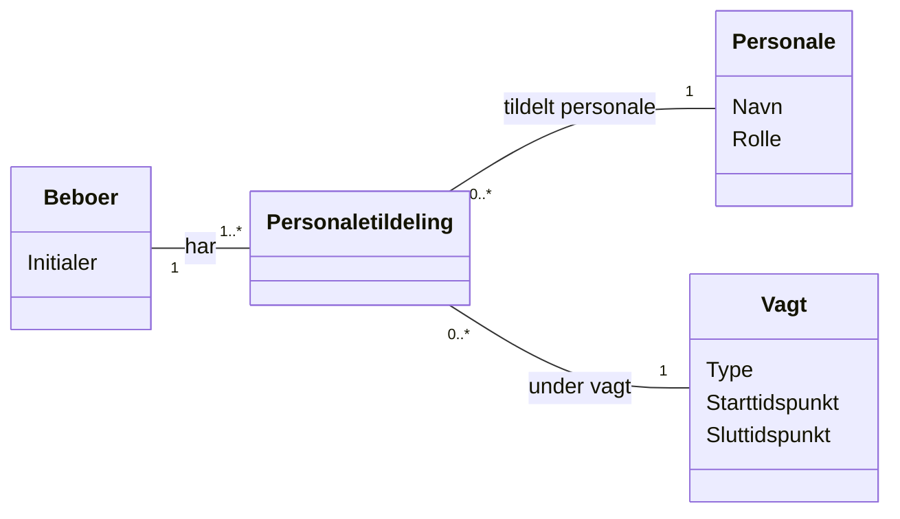

# Domænemodel (DM) for Tildeling af Personale til Beboere

## Metadata
| Nøgle               | Værdi                             |
|---------------------|-----------------------------------|
| Id                  | UC-008.DM                         |
| crossReference      | UC-008                            |

## Versionslog
| Version | Dato       | Beskrivelse              | Forfatter     |
|---------|------------|--------------------------|---------------|
| 0001    | 2026-05-06 | Initial                  | Team 6        |

## Diagram

## Antagelser og Afhængigheder
- Hver beboer skal have mindst én personalemedlem tildelt under en vagt.
- Et personale medlem kan tildeles én eller flere beboere.
- Personaletildeling forbinder en beboer, et personalemedlem og en vagt.
- Kun autoriserede roller kan oprette eller opdatere personaletildelinger.
- Ændringer i personaletildelinger logges i audit trail.

## Termoversættelse

| Original Term     | Dansk Oversættelse      |
|------------------|-------------------------|
| Resident         | Beboer                  |
| Staff            | Personale               |
| Shift            | Vagt                    |
| StaffAssignment  | Personaletildeling      |
| Initials         | Initialer               |
| Name             | Navn                    |
| Role             | Rolle                   |
| Type             | Type                    |
| StartTime        | Starttidspunkt          |
| EndTime          | Sluttidspunkt           |

## Noter
- Modellen understøtter tildeling af personale til beboere under dag-, aften- og nattevagter.
- Modellen understøtter tydeligt ansvar og synlighed over personaletildelinger.
- Opdateringer af tildelinger under en vagt skal gemmes og logges.
