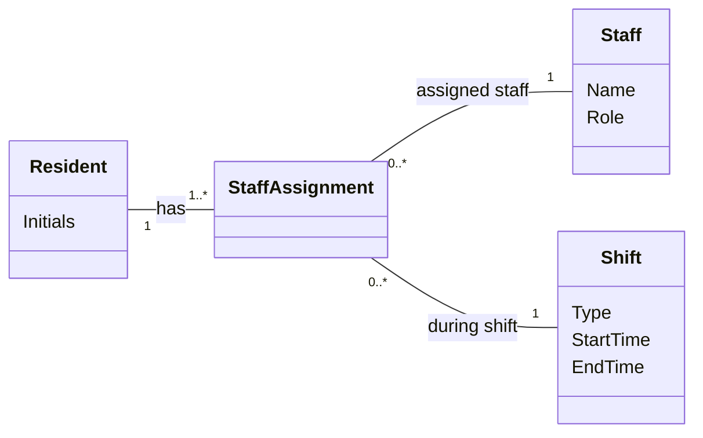

# Domain Model for Assign Staff to Residents

## Metadata
| Key               | Value                             |
|-------------------|-----------------------------------|
| Id                | UC008-AssignStaff-DM              |
| crossReference    | UC-008                            |

## Version Log
| Version | Date       | Description       | Author     |
|---------|------------|-------------------|------------|
| 0001    | 2026-05-06 | Domain model      | Team 6     |

## Diagram

## Assumptions and Dependencies
- Each Resident must have at least one StaffAssignment during a shift.
- A Staff member can be assigned to one or more Residents.
- StaffAssignment connects a Resident, Staff member, and Shift.
- Only authorized roles can create or update StaffAssignments.
- Changes to StaffAssignments are logged in the audit trail.

## Terms Translation

| Original Term     | Danish Translation      |
|------------------|-------------------------|
| Resident         | Beboer                  |
| Staff            | Personale               |
| Shift            | Vagt                    |
| StaffAssignment  | Personaletildeling      |
| Initials         | Initialer               |
| Name             | Navn                    |
| Role             | Rolle                   |
| Type             | Type                    |
| StartTime        | Starttidspunkt          |
| EndTime          | Sluttidspunkt           |

## Notes
- The model supports assigning staff members to Residents during day, evening, and night shifts.
- The model supports clear responsibility and visibility of staff assignments.
- Assignment updates during a shift must be saved and logged.
