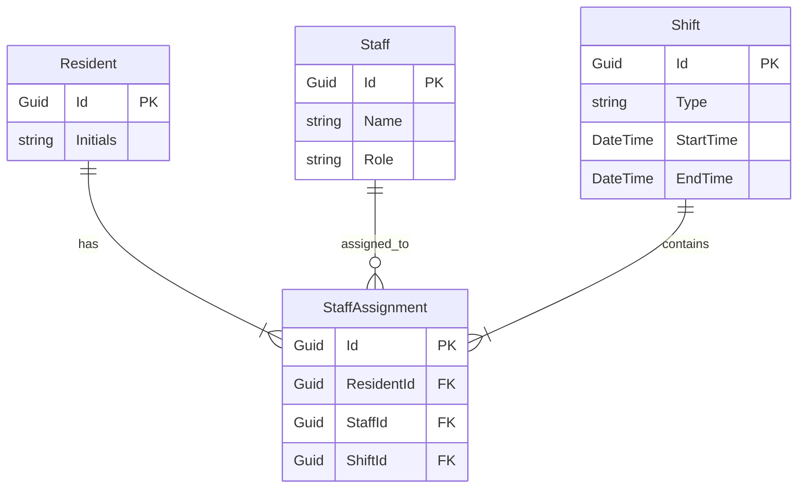

# Entity Relationship Diagram (ERD) for UC-008 Assign Staff to Residents

## Metadata
| Key               | Value                             |
|-------------------|-----------------------------------|
| Id                | ERD-008                           |
| crossReference    | UC-008                            |

## Version Log
| Version | Date       | Description          | Author |
|---------|------------|----------------------|--------|
| 0001    | 2026-05-06 | Initial              | Team 6 |

## Entity Relationship Diagram



## Notes
- Resident stores the resident identifier used for assignments.
- Staff stores staff member information and role.
- Shift stores the shift type, start time, and end time.
- StaffAssignment connects one Resident, one Staff member, and one Shift.
- A Resident must have at least one StaffAssignment during a shift.
- A Staff member can be assigned to multiple Residents.
- A Shift contains one or more StaffAssignments.
- StaffAssignment uses foreign keys to reference Resident, Staff, and Shift.
```