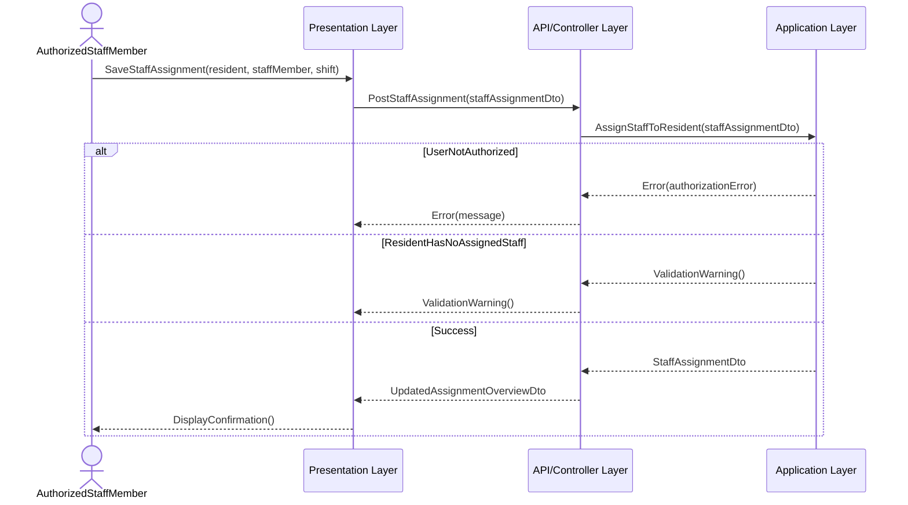
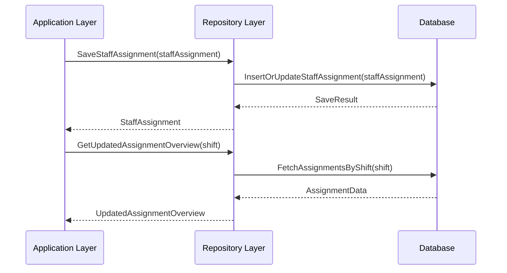

# Sequence Diagram for UC-008: Assign Staff to Residents

## Metadata
| Key            | Value           |
|----------------|-----------------|
| Id             | UC-008.SD       |
| crossReference | UC-008          |

## Version Log
| Version | Date       | Description           | Author |
|---------|------------|-----------------------|--------|
| 0001    | 2026-05-06 | Initial SD creation   | Team 6 |

## Sequence Diagram: Assign Staff to Residents

### Presentation → Application

### Application → Infrastructure

## Notes
- DTOs are used for data transfer between the UI, controller, and service.
- The service validates authorization and assignment rules before saving.
- The repository handles persistence of StaffAssignment data.
- The database stores the staff assignment for the selected Resident and Shift.
- Assignment changes must be logged according to the audit trail requirement.

## Compliance
- Follows SD agent and Clean Architecture instructions.
- Version log maintained.
- Supports UC-008 staff assignment requirements.

## Language Handling
Professional English for metadata and versioning; domain language in diagram content.