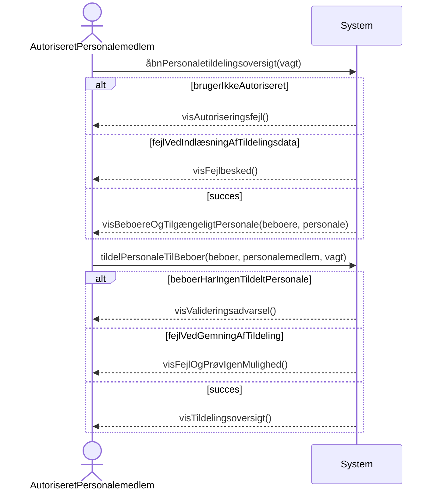

# Systemsekvensdiagram for Tildeling af Personale til Beboere

## Metadata
| Nøgle           | Værdi                     |
|-----------------|---------------------------|
| Id              | UC-008.SSD                |
| crossReference  | UC-008 UC-008.DM          |

## Versionslog
| Version | Dato       | Beskrivelse              | Forfatter |
|---------|------------|--------------------------|------------|
| 0001    | 2026-05-06 | Initial                  | Team 6     |

## Systemsekvensdiagram

## Sprogoversættelse

| Original Term          | Dansk Oversættelse        |
|-----------------------|---------------------------|
| AuthorizedStaffMember | AutoriseretPersonalemedlem |
| Resident              | Beboer                    |
| Staff                 | Personale                 |
| StaffMember           | Personalemedlem           |
| Shift                 | Vagt                      |
| StaffAssignment       | Personaletildeling        |
| AssignmentOverview    | Tildelingsoversigt        |
| AuditTrail            | Audit trail               |

## Noter
- Systemet validerer, at beboeren har mindst ét tildelt personalemedlem.
- Kun autoriserede roller kan oprette eller opdatere personaletildelinger.
- Ændringer i personaletildelinger logges i audit trail.
- Den opdaterede tildelingsoversigt viser ansvar under vagten.