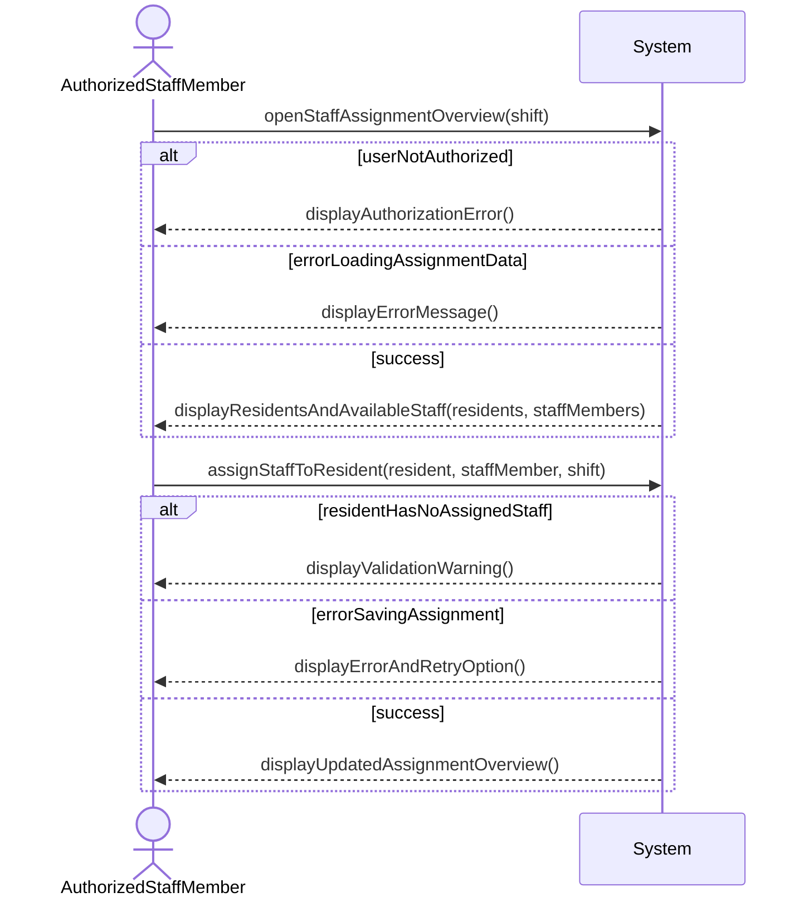

# System Sequence Diagram for Assign Staff to Residents

## Metadata
| Key               | Value                             |
|-------------------|-----------------------------------|
| Id                | UC008.SSD                         |
| crossReference    | UC-008  UC-008.DM                 |

## Version Log
| Version | Date       | Description                    | Author     |
|---------|------------|--------------------------------|------------|
| 0001    | 2026-05-06 | System sequence diagram        | Team 6     |

## System Sequence Diagram

---

## Language Translation

| Original Term          | Danish Translation      |
|-----------------------|-------------------------|
| AuthorizedStaffMember | AutoriseretPersonalemedlem |
| Resident              | Beboer                  |
| Staff                 | Personale               |
| StaffMember           | Personalemedlem         |
| Shift                 | Vagt                    |
| StaffAssignment       | Personaletildeling      |
| AssignmentOverview    | Tildelingsoversigt      |
| AuditTrail            | Audit trail             |

## Notes
- The system validates that the Resident has at least one assigned staff member.
- Only authorized roles can assign or update staff assignments.
- Assignment changes are logged in the audit trail.
- The updated assignment overview shows responsibility during the shift.
