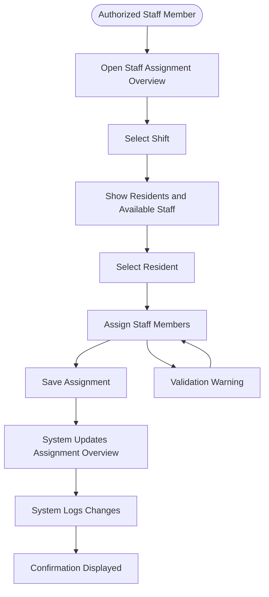

# User Flow Diagram for Assign Staff to Residents

## Metadata
| Key               | Value                             |
|-------------------|-----------------------------------|
| Id                | UC008-AssignStaff-Flow            |
| crossReference    | UC-008                            |

## Version Log
| Version | Date       | Description           | Author     |
|---------|------------|-----------------------|------------|
| 0001    | 2026-05-06 | User flow diagram     | Team 6     |

## User Flow Diagram

### Primary Flow
1.The Authorized Staff Member opens the staff assignment overview  
2.The system displays Residents and available staff members  
3.The Authorized Staff Member selects a Resident  
4.The Authorized Staff Member assigns one or more staff members  
5.The system validates the assignment  
6.The Authorized Staff Member saves the assignment  
7.The system updates the assignment overview  
8.The system logs the assignment changes in the audit trail  

---
### Update Assignment Flow
1a.The Authorized Staff Member opens the current shift assignment overview  
2a.The system displays current Resident assignments  
3a.The Authorized Staff Member updates the assigned staff members  
4a.The system validates the updated assignment  
5a.The system saves the updated assignment  
6a.The system updates the overview and logs the changes  

---

### Validation Error Flow
1b.The Authorized Staff Member attempts to save the assignment  
2b.The system checks if each Resident has at least one assigned staff member  
3b.If a Resident has no assigned staff member, the system displays a validation warning  
4b.The Authorized Staff Member updates the assignment  
5b.The system saves the corrected assignment  

---

# User Flow Diagram (Visual)

