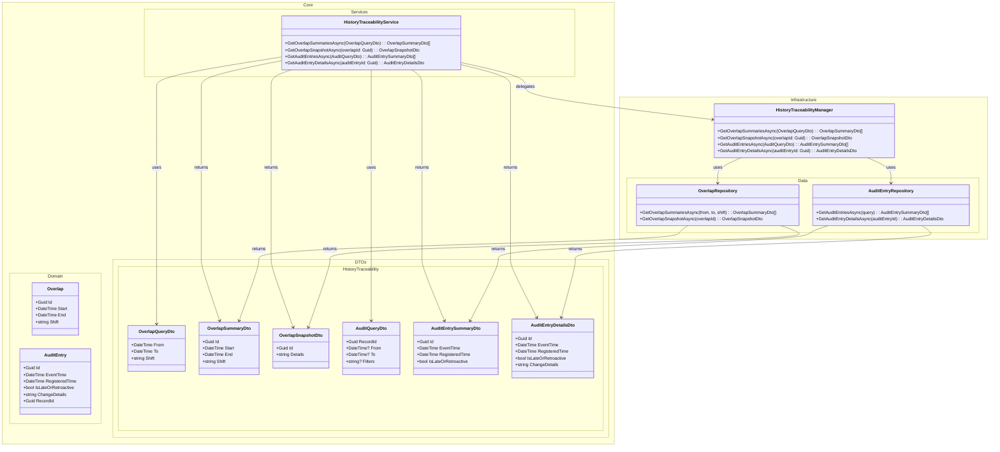

# Domain Class Diagram (DCD) for Use Case 009: View History and Traceability

## Metadata
| Key               | Value                                                |
|-------------------|------------------------------------------------------|
| Id                | UC-009.DCD                                          |
| crossReference    | UC-009.SD UC-009.OC UC-009.DM                  |

## Version Log
| Version | Date       | Description              | Author     |
|---------|------------|--------------------------|------------|
| 0001    | 2026-05-08 | Initial                  | TEAM 6     |

---

---

## Notes
- DTOs are used for all cross-layer boundaries.
- Service and manager classes orchestrate queries and data access.
- Domain entities are not exposed outside the domain.
- Clean Architecture dependency direction is preserved.
- Late/retroactive entries are modeled with both `EventTime` and `RegisteredTime`.
- This DCD is based on the UC-009 sequence diagram and Clean Architecture conventions.
