```mermaid
%% DCD for Use Case 009: View History and Traceability
classDiagram
  direction TB

  namespace Domain.Entities {
    class AuditEntry {
      +Guid Id
      +string Metadata
      +DateTime StartTimeUtc
      +DateTime EndTimeUtc
      +bool Succeeded
      +Guid UserId
      +string ErrorMessage
      +ICollection~ChangeDetail~ ChangeDetails
    }
    class ChangeDetail {
      +Guid Id
      +string Field
      +string OldValue
      +string NewValue
      +Guid AuditEntryId
    }
  }

  namespace Core.DTOs.Audit {
    class AuditEntryDto {
      +Guid Id
      +DateTime EventTimeUtc
      +DateTime RegisteredTimeUtc
      +string Entity
      +string ChangeType
      +string Description
      +Guid UserId
      +string UserName
      +bool Succeeded
      +IEnumerable~ChangeDetailDto~ ChangeDetails
    }
    class ChangeDetailDto {
      +Guid Id
      +string Field
      +string OldValue
      +string NewValue
    }
  }

  namespace Core.Mappers {
    class AuditMapper {
      <<static>>
      +ToDto(AuditEntry, string userName) AuditEntryDto$
      +ToDtos(IEnumerable~AuditEntry~) IEnumerable~AuditEntryDto~$
    }
    class ChangeDetailMapper {
      <<static>>
      +ToDto(ChangeDetail) ChangeDetailDto$
      +ToDtos(IEnumerable~ChangeDetail~) IEnumerable~ChangeDetailDto~$
    }
  }

  namespace Core.Interfaces {
    class IAuditService {
      <<interface>>
      +LogAsync(entityName, changeType, changedBy, description) Task
      +GetRecentAsync(int? limit, ct) Task~IEnumerable~AuditEntryDto~~
      +GetByEntityNameAsync(string, ct) Task~IEnumerable~AuditEntryDto~~
      +GetWithDetailsAsync(Guid, ct) Task~AuditEntryDto?~
    }
    class IAuditManager {
      <<interface>>
      +GetRecentAsync(int? limit, ct) Task~IEnumerable~AuditEntryDto~~
      +GetByEntityNameAsync(string, ct) Task~IEnumerable~AuditEntryDto~~
      +GetWithDetailsAsync(Guid, ct) Task~AuditEntryDto?~
    }
    class IAuditRepository {
      <<interface>>
      +GetRecentAsync(int? limit, ct) Task~IEnumerable~AuditEntry~~
      +GetByEntityNameAsync(string, ct) Task~IEnumerable~AuditEntry~~
      +GetWithDetailsAsync(Guid, ct) Task~AuditEntry?~
    }
  }

  namespace Core.Services {
    class AuditService {
      -IAuditManager _auditManager
      +LogAsync(...) Task
      +GetRecentAsync(int?, ct) Task~IEnumerable~AuditEntryDto~~
      +GetByEntityNameAsync(string, ct) Task~IEnumerable~AuditEntryDto~~
      +GetWithDetailsAsync(Guid, ct) Task~AuditEntryDto?~
    }
  }

  namespace Infrastructure.Managers {
    class AuditManager {
      -IAuditRepository _auditRepository
      +GetRecentAsync(int?, ct) Task~IEnumerable~AuditEntryDto~~
      +GetByEntityNameAsync(string, ct) Task~IEnumerable~AuditEntryDto~~
      +GetWithDetailsAsync(Guid, ct) Task~AuditEntryDto?~
    }
  }

  namespace Infrastructure.Data {
    class AuditRepository {
      -AppDbContext _dbContext
      +GetRecentAsync(int?, ct) Task~IEnumerable~AuditEntry~~
      +GetByEntityNameAsync(string, ct) Task~IEnumerable~AuditEntry~~
      +GetWithDetailsAsync(Guid, ct) Task~AuditEntry?~
    }
    class AuditInterceptor {
      <<existing>>
      +SavingChangesAsync(...) creates AuditEntry automatically
    }
  }

  %% Relationships
  AuditEntry "1" --> "*" ChangeDetail : has
  AuditEntryDto "1" --> "*" ChangeDetailDto : has

  %% Implementation
  AuditService ..|> IAuditService : implements
  AuditManager ..|> IAuditManager : implements
  AuditRepository ..|> IAuditRepository : implements

  %% Dependencies (delegation chain)
  AuditService --> IAuditManager : uses
  AuditManager --> IAuditRepository : uses
  AuditRepository --> AuditEntry : queries
  AuditRepository --> ChangeDetail : queries

  %% Mapping
  AuditManager --> AuditMapper : uses
  AuditMapper --> ChangeDetailMapper : uses
  AuditMapper --> AuditEntryDto : produces
  ChangeDetailMapper --> ChangeDetailDto : produces

  %% Auto-write (separate from UC-009 read flow)
  AuditInterceptor --> AuditEntry : creates on SaveChanges
```

# Domain Class Diagram (DCD) for Use Case 009: View History and Traceability

## Metadata
| Key               | Value                                                |
|-------------------|------------------------------------------------------|
| Id                | UC-009.DCD                                           |
| crossReference    | UC-009.SD UC-009.OC UC-009.DM UC-009.ERD    |

## Version Log
| Version | Date       | Description                                                                 | Author |
|---------|------------|-----------------------------------------------------------------------------|--------|
| 0001    | 2026-05-08 | Initial                                                                     | Team 6 |
| 0002    | 2026-05-08 | Aligned with actual codebase: AuditEntry/ChangeDetail entities, AuditService/Manager/Repository, builds on existing AuditInterceptor | Team 6 |

---

---

## Notes

### Architecture
- Strict Clean Architecture: Core defines all interfaces (`IAuditService`, `IAuditManager`, `IAuditRepository`); Infrastructure implements them.
- Service → Manager → Repository delegation chain mirrors the existing `PhoneAssignmentService` pattern.
- Domain entities (`AuditEntry`, `ChangeDetail`) are never exposed across layer boundaries; DTOs are used for all cross-layer transfer.

### UC-009 read flow
- `IAuditService` exposes three read methods consumed by the API/UI layer.
- `AuditMapper` parses `AuditEntry.Metadata` (formatted as `"EntityName - ChangeType"`) into the separate `Entity` and `ChangeType` fields used by the UI.
- `EventTimeUtc` maps from `AuditEntry.StartTimeUtc`; `RegisteredTimeUtc` maps from `AuditEntry.EndTimeUtc`. UI can derive `IsLateOrRetroactive` by comparing the two.
- `UserName` is joined in by the manager from the `Users` table; it is not stored on the entity.

### UC-009 write flow (out of scope for this UC, but relevant)
- `AuditEntry` records are written automatically by `AuditInterceptor` (Infrastructure.Data) on every successful `SaveChanges`.
- `IAuditService.LogAsync` is retained for explicit logging needs (legacy / future use).
- `ChangeDetail` records may be written by future enhancements; they are not produced by the current interceptor.

### Alignment with ERD
- Matches `AUDITENTRY` and `CHANGEDETAIL` entities as defined in UC-009.ERD.
- `Entity`, `ChangeType`, `Description` fields on `AuditEntryDto` correspond to the ERD's `AUDITENTRY` columns.
- The relationship `AUDITENTRY ||--o{ CHANGEDETAIL : details` in ERD maps to `AuditEntry "1" --> "*" ChangeDetail` in this DCD.
