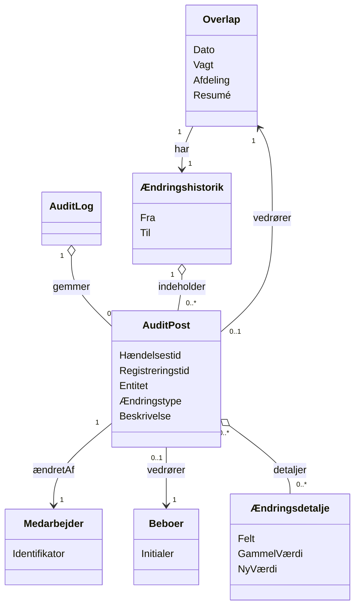

# Domænemodel (DM) for Se historik og sporbarhed

## Metadata
| Nøgle               | Værdi                             |
|---------------------|-----------------------------------|
| Id                  | UC-009.DM                         |
| crossReference      | BC UC-009 REQ-F-006 REQ-F-007 REQ-R-003 |

## Versionslog
| Version | Dato       | Beskrivelse              | Forfatter |
|---------|------------|--------------------------|----------|
| 0001    | 2026-05-08 | Initial                  | Team 6   |

## Diagram

## Antagelser og Afhængigheder
- Alle auditerbare ændringer og relevante brugerhandlinger skaber uforanderlige `AuditPost`-registreringer i `AuditLog`.
- Sene/tilbagevirkende indtastninger repræsenteres ved både `Hændelsestid` (hvornår det faktisk skete) og `Registreringstid` (hvornår det blev registreret).
- `Ændringshistorik` er en filtreret visning (pr. registrering og/eller tidsinterval) af audit-poster, som vises til brugeren.
- Adgang til historik/audit kræver autorisation; uautoriserede forsøg logges.

## Termoversættelse

| Original Term         | Dansk Oversættelse               |
|----------------------|----------------------------------|
| Resident             | Beboer                           |
| User                 | Medarbejder                      |
| Overlap              | Overlap (vagtskifte)             |
| AuditLog             | Audit-log                        |
| ChangeHistory        | Ændringshistorik                 |
| AuditEntry           | Audit-post                       |
| EventTime            | Hændelsestid                     |
| RegisteredTime       | Registreringstid                 |
| ChangeType           | Ændringstype                     |
| Changed by           | Ændret af                        |
| ChangeDetail         | Ændringsdetalje                  |
| Timestamp            | Tidsstempel                      |
| Late entry           | Sen indtastning                  |
| Retroactive entry    | Tilbagevirkende indtastning      |

## Noter
- UC-009 historik og sporbarhed er skrivebeskyttet (read-only) og ændrer ikke forretningsdata.
- Brugerfladen viser audit-oplysninger som en kronologisk liste og giver detaljer for valgt post.
- `Entitet` i `AuditPost` vises som en genkendelig registreringstype (fx Notat, Opgave, TelefonTildeling, Overlap).
