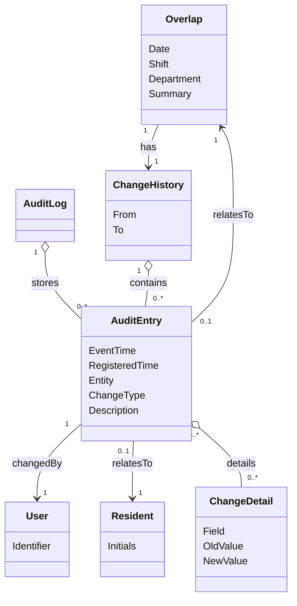

# Domain Model (DM) for View history and traceability

## Metadata
| Key               | Value                             |
|-------------------|-----------------------------------|
| Id                | UC-009.DM                         |
| crossReference    | BC UC-009 REQ-F-006 REQ-F-007 REQ-R-003 |

## Version Log
| Version | Date       | Description              | Author     |
|---------|------------|--------------------------|------------|
| 0001    | 2026-05-08 | Initial                  | Team 6     |

## Diagram

## Assumptions and Dependencies
- All auditable changes and relevant user actions create immutable `AuditEntry` records in the `AuditLog`.
- Late/retroactive entries are represented by having both `EventTime` (when it actually happened) and `RegisteredTime` (when it was entered/recorded).
- `ChangeHistory` is a filtered view (by record and/or time range) of `AuditEntry` records presented to the user.
- Access to audit/history requires authorization; unauthorized access attempts are logged.

## Terms Translation

| Original Term         | Danish Translation                |
|----------------------|-----------------------------------|
| Resident             | Beboer                            |
| User                 | Medarbejder                       |
| Overlap              | Overlap (vagtskifte)              |
| AuditLog             | Audit-log                         |
| ChangeHistory        | Ændringshistorik                  |
| AuditEntry           | Audit-post                        |
| EventTime            | Hændelsestid                      |
| RegisteredTime       | Registreringstid                  |
| ChangeType           | Ændringstype                      |
| Changed by           | Ændret af                         |
| ChangeDetail         | Ændringsdetalje                   |
| Timestamp            | Tidsstempel                       |
| Late entry           | Sen indtastning                   |
| Retroactive entry    | Tilbagevirkende indtastning       |

## Notes
- The UC-009 history and traceability view is read-only; it does not change business data.
- The UI presents audit information as a chronological list and provides details per selected entry.
- `Entity` in `AuditEntry` is shown to users as a recognizable record type (e.g., ResidentNote, Task, PhoneAssignment, Overlap).
