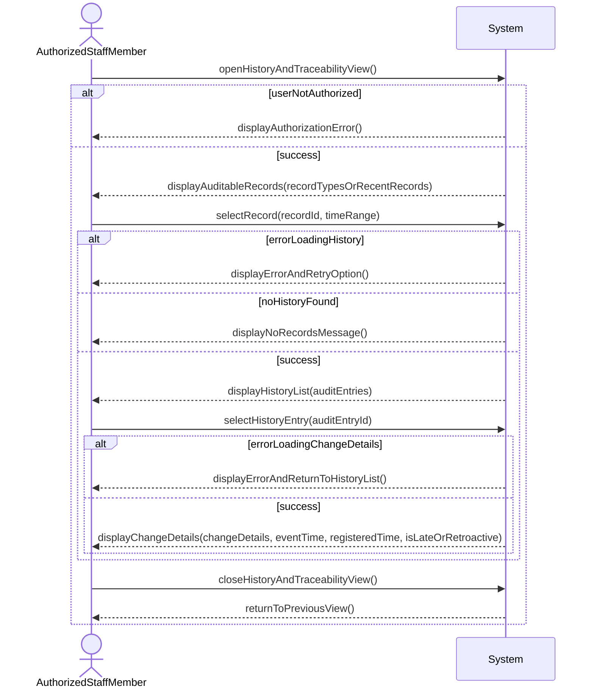

# Operation Contract: View history and traceability

## Metadata
| Key            | Value                      |
|----------------|----------------------------|
| Id             | UC-009.OC                  |
| crossReference | UC-009.SSD UC-009.DM       |

## Version Log
| Version | Date       | Description | Author |
|---------|------------|-------------|--------|
| 0001    | 2026-05-08 | Initial     | Team 6 |

## Operation Contract

### Open History and Traceability View
- **Preconditions**: AuthorizedStaffMember is authenticated.
- **Postconditions**: System displays available auditable record types and/or recent records; if the user is not authorized, System displays an authorization error.

### Select Record and Time Range
- **Preconditions**: History and Traceability view is open and System has displayed auditable records.
- **Postconditions**: System displays a history list (audit entries) for the selected record and time range; if System cannot load history, System displays an error with a retry option; if no history exists, System displays a no-records message.

### Select History Entry
- **Preconditions**: System displays a history list for the selected record.
- **Postconditions**: System displays change details including event time, registration time, and whether the entry is late or retroactive; if System cannot load change details, System displays an error and returns to the history list.

### Close History and Traceability View
- **Preconditions**: History and Traceability view is open.
- **Postconditions**: System returns to the previous view.
