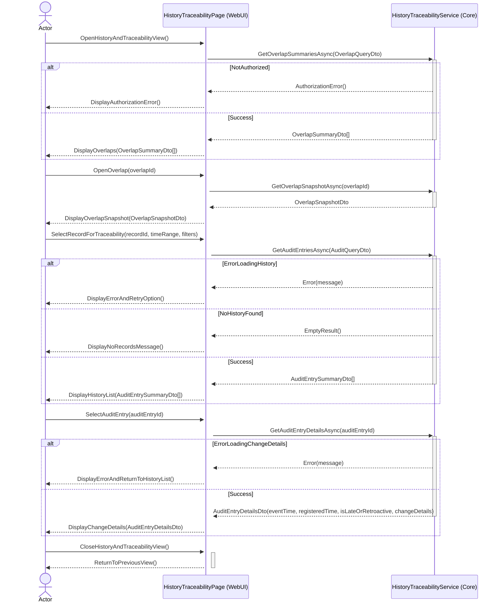
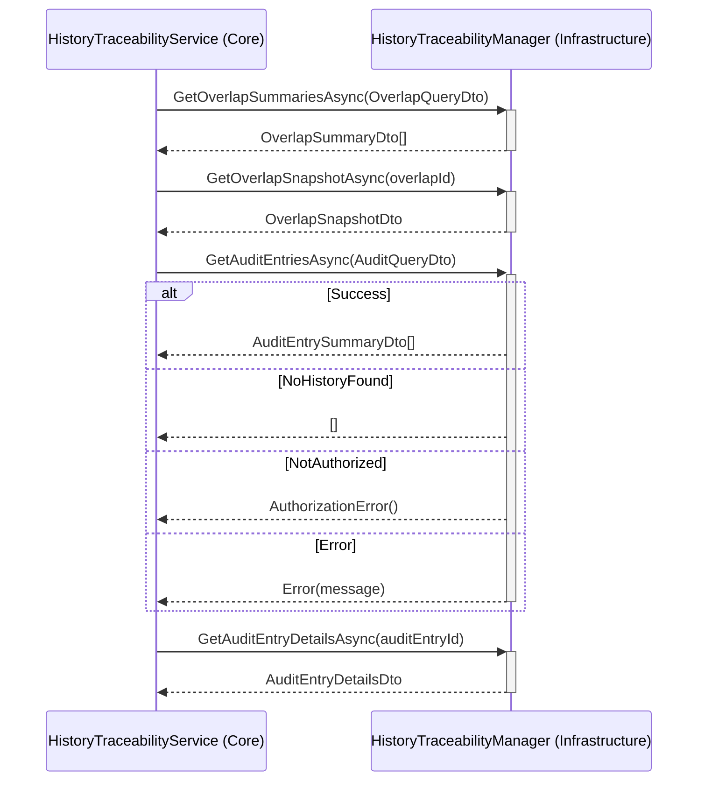
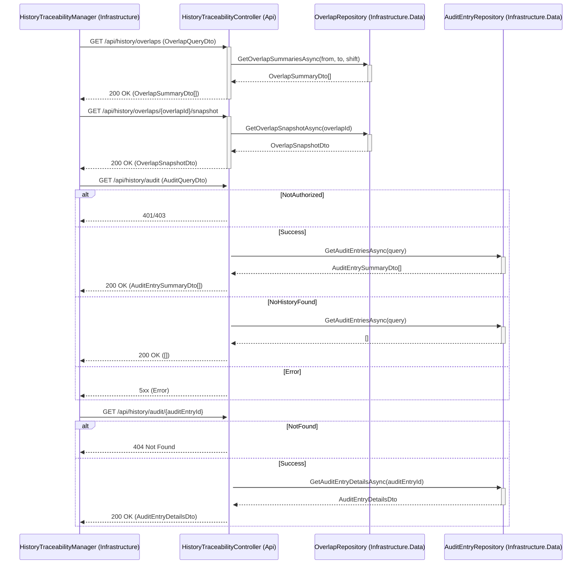

# UC-009 View History and Traceability Sequence Diagram

## Metadata
| Key            | Value                                |
|----------------|--------------------------------------|
| Id             | UC-009.SD                            |
| crossReference | UC-009.SSD UC-009.OC UC-009.DM       |

## Version Log
| Version | Date       | Description | Author |
|---------|------------|-------------|--------|
| 0001    | 2026-05-08 | Initial     | Team 6 |

## Sequence Diagram

### Presentation Layer → Application Layer

### Application Layer → Infrastructure Layer (External Interfaces)

### WebApi Layer → Infrastructure Layer (Data Access)

## Notes
- UC-009 is read-only: viewing history does not modify business data.
- Late/retroactive entries are presented using both `eventTime` and `registeredTime` (REQ-F-007).
- DTOs are used across boundaries to avoid leaking domain entities:
  - `OverlapQueryDto`, `OverlapSummaryDto`, `OverlapSnapshotDto`
  - `AuditQueryDto`, `AuditEntrySummaryDto`, `AuditEntryDetailsDto`
- Clean Architecture dependency direction is preserved (Infrastructure → Application → Domain).
