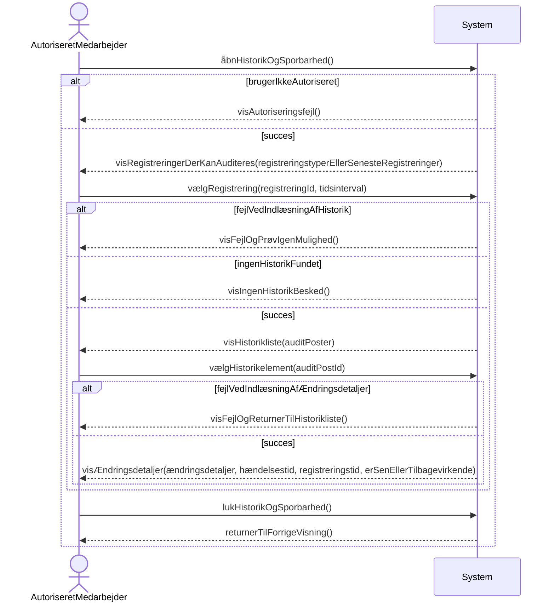

# Systemsekvensdiagram for Se historik og sporbarhed

## Metadata
| Nøgle           | Værdi            |
|-----------------|------------------|
| Id              | UC-009.SSD       |
| crossReference  | UC-009 UC-009.DM |

## Versionslog
| Version | Dato       | Beskrivelse | Forfatter |
|---------|------------|-------------|-----------|
| 0001    | 2026-05-08 | Initial SSD | Team 6    |

## Systemsekvensdiagram

## Sprogoversættelse

| Original Term       | Dansk Oversættelse            |
|--------------------|-------------------------------|
| History             | Historik                       |
| Traceability        | Sporbarhed                     |
| Audit trail         | Audit trail / revisionsspor    |
| Audit log           | Audit-log                      |
| Audit entry         | Audit-post                     |
| Event time          | Hændelsestid                   |
| Registration time   | Registreringstid               |
| Late entry          | Sen indtastning                |
| Retroactive entry   | Tilbagevirkende indtastning    |
| Change details      | Ændringsdetaljer               |
| Authorization       | Autorisation                   |
| No records message  | Ingen historik                 |
