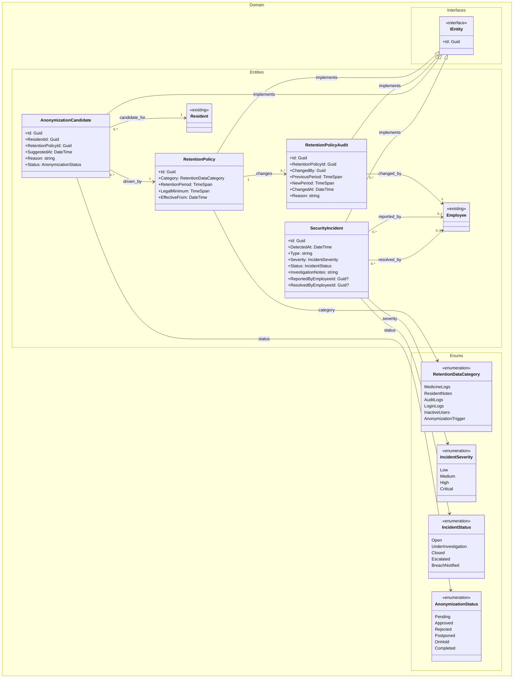

# Domain Class Diagram (DCD) for UC-010 Ensure data security and GDPR compliance

## Metadata
| Key            | Value |
|----------------|-------|
| Id             | UC-010.DCD |
| crossReference | UC-010.SD UC-010.DM UC-010.SSD UC-010.OC |
| Author         | Team 6 |
| Version        | 0001 |
| Date           | 2026-05-11 |

## Version Log
| Version | Date       | Description | Author |
|---------|------------|-------------|--------|
| 0001    | 2026-05-11 | Initial     | Team 6 |

---

## DCD for Domain Layer

---

## DCD for Core Layer

```mermaid
classDiagram
  direction TB

  namespace Core.DTOs.Retention {
    class RetentionPolicyDto {
      +Id: Guid
      +Category: RetentionDataCategory
      +RetentionPeriod: TimeSpan
      +LegalMinimum: TimeSpan
      +EffectiveFrom: DateTime
    }

    class UpdateRetentionPolicyDto {
      +Category: RetentionDataCategory
      +RetentionPeriod: TimeSpan
      +Reason: string
    }

    class RetentionPolicyAuditDto {
      +Id: Guid
      +RetentionPolicyId: Guid
      +ChangedBy: Guid
      +PreviousPeriod: TimeSpan
      +NewPeriod: TimeSpan
      +ChangedAt: DateTime
      +Reason: string
    }
  }

  namespace Core.DTOs.Anonymization {
    class AnonymizationCandidateDto {
      +Id: Guid
      +ResidentId: Guid
      +RetentionPolicyId: Guid
      +SuggestedAt: DateTime
      +Reason: string
      +Status: AnonymizationStatus
    }

    class ApproveAnonymizationDto {
      +CandidateId: Guid
    }

    class AnonymizationResultDto {
      +CandidateId: Guid
      +CompletedAt: DateTime
      +Outcome: string
    }
  }

  namespace Core.DTOs.Security {
    class SecurityIncidentDto {
      +Id: Guid
      +DetectedAt: DateTime
      +Type: string
      +Severity: IncidentSeverity
      +Status: IncidentStatus
      +InvestigationNotes: string
    }

    class EscalateIncidentDto {
      +IncidentId: Guid
      +IsBreach: bool
    }

    class AddInvestigationNotesDto {
      +IncidentId: Guid
      +Notes: string
    }
  }

  namespace Core.DTOs.Sar {
    class SarExportRequestDto {
      +ResidentId: Guid
      +ScopeOptions: string[]
    }

    class SarExportPackageDto {
      +ExportId: Guid
      +GeneratedAt: DateTime
      +FileName: string
    }

    class SarFulfilledDto {
      +SarId: Guid
      +FulfilledAt: DateTime
    }
  }

  namespace Core.Interfaces.Repositories {
    class IRetentionPolicyRepository {
      <<interface>>
      +GetAllAsync(ct: CancellationToken): Task~IEnumerable~RetentionPolicy~~
      +GetByCategoryAsync(category: RetentionDataCategory, ct: CancellationToken): Task~RetentionPolicy?~
      +UpdateAsync(entity: RetentionPolicy, ct: CancellationToken): Task
    }

    class IAnonymizationCandidateRepository {
      <<interface>>
      +GetPendingAsync(ct: CancellationToken): Task~IEnumerable~AnonymizationCandidate~~
      +GetByIdAsync(candidateId: Guid, ct: CancellationToken): Task~AnonymizationCandidate?~
      +UpdateAsync(entity: AnonymizationCandidate, ct: CancellationToken): Task
    }

    class ISecurityIncidentRepository {
      <<interface>>
      +GetOpenAsync(ct: CancellationToken): Task~IEnumerable~SecurityIncident~~
      +GetByIdAsync(incidentId: Guid, ct: CancellationToken): Task~SecurityIncident?~
      +UpdateAsync(entity: SecurityIncident, ct: CancellationToken): Task
    }
  }

  namespace Core.Interfaces.Managers {
    class IRetentionPolicyManager {
      <<interface>>
      +GetPoliciesAsync(ct: CancellationToken): Task~Result~IEnumerable~RetentionPolicyDto~~~
      +UpdateRetentionPolicyAsync(dto: UpdateRetentionPolicyDto, ct: CancellationToken): Task~Result~RetentionPolicyDto~~
    }

    class IAnonymizationManager {
      <<interface>>
      +GetCandidatesAsync(ct: CancellationToken): Task~Result~IEnumerable~AnonymizationCandidateDto~~~
      +ApproveAnonymizationAsync(candidateId: Guid, ct: CancellationToken): Task~Result~AnonymizationResultDto~~
      +RejectAnonymizationAsync(candidateId: Guid, reason: string, ct: CancellationToken): Task~Result~bool~~
    }

    class ISecurityIncidentManager {
      <<interface>>
      +GetIncidentsAsync(ct: CancellationToken): Task~Result~IEnumerable~SecurityIncidentDto~~~
      +EscalateIncidentAsync(incidentId: Guid, isBreach: bool, ct: CancellationToken): Task~Result~SecurityIncidentDto~~
      +AddInvestigationNotesAsync(dto: AddInvestigationNotesDto, ct: CancellationToken): Task~Result~SecurityIncidentDto~~
    }

    class ISubjectAccessRequestManager {
      <<interface>>
      +GenerateExportAsync(dto: SarExportRequestDto, ct: CancellationToken): Task~Result~SarExportPackageDto~~
      +MarkFulfilledAsync(dto: SarFulfilledDto, ct: CancellationToken): Task~Result~bool~~
    }
  }

  namespace Core.Interfaces.Services {
    class IRetentionPolicyService {
      <<interface>>
      +GetPoliciesAsync(ct: CancellationToken): Task~Result~IEnumerable~RetentionPolicyDto~~~
      +UpdateRetentionPolicyAsync(dto: UpdateRetentionPolicyDto, ct: CancellationToken): Task~Result~RetentionPolicyDto~~
    }

    class IAnonymizationService {
      <<interface>>
      +GetCandidatesAsync(ct: CancellationToken): Task~Result~IEnumerable~AnonymizationCandidateDto~~~
      +ApproveAnonymizationAsync(candidateId: Guid, ct: CancellationToken): Task~Result~AnonymizationResultDto~~
      +RejectAnonymizationAsync(candidateId: Guid, reason: string, ct: CancellationToken): Task~Result~bool~~
    }

    class ISecurityIncidentService {
      <<interface>>
      +GetIncidentsAsync(ct: CancellationToken): Task~Result~IEnumerable~SecurityIncidentDto~~~
      +EscalateIncidentAsync(incidentId: Guid, isBreach: bool, ct: CancellationToken): Task~Result~SecurityIncidentDto~~
      +AddInvestigationNotesAsync(dto: AddInvestigationNotesDto, ct: CancellationToken): Task~Result~SecurityIncidentDto~~
    }

    class ISubjectAccessRequestService {
      <<interface>>
      +GenerateExportAsync(dto: SarExportRequestDto, ct: CancellationToken): Task~Result~SarExportPackageDto~~
      +MarkFulfilledAsync(dto: SarFulfilledDto, ct: CancellationToken): Task~Result~bool~~
    }

    class IArt33NotificationService {
      <<interface>>
      +SendNotificationAsync(incidentId: Guid, dpoEmail: string, ct: CancellationToken): Task~Result~bool~~
    }
  }

  namespace Core.Services {
    class RetentionPolicyService {
      -IRetentionPolicyManager _retentionPolicyManager
      +GetPoliciesAsync(ct: CancellationToken): Task~Result~IEnumerable~RetentionPolicyDto~~~
      +UpdateRetentionPolicyAsync(dto: UpdateRetentionPolicyDto, ct: CancellationToken): Task~Result~RetentionPolicyDto~~
    }

    class AnonymizationService {
      -IAnonymizationManager _anonymizationManager
      +GetCandidatesAsync(ct: CancellationToken): Task~Result~IEnumerable~AnonymizationCandidateDto~~~
      +ApproveAnonymizationAsync(candidateId: Guid, ct: CancellationToken): Task~Result~AnonymizationResultDto~~
      +RejectAnonymizationAsync(candidateId: Guid, reason: string, ct: CancellationToken): Task~Result~bool~~
    }

    class SecurityIncidentService {
      -ISecurityIncidentManager _securityIncidentManager
      -IArt33NotificationService _art33NotificationService
      +GetIncidentsAsync(ct: CancellationToken): Task~Result~IEnumerable~SecurityIncidentDto~~~
      +EscalateIncidentAsync(incidentId: Guid, isBreach: bool, ct: CancellationToken): Task~Result~SecurityIncidentDto~~
      +AddInvestigationNotesAsync(dto: AddInvestigationNotesDto, ct: CancellationToken): Task~Result~SecurityIncidentDto~~
    }

    class SubjectAccessRequestService {
      -ISubjectAccessRequestManager _subjectAccessRequestManager
      +GenerateExportAsync(dto: SarExportRequestDto, ct: CancellationToken): Task~Result~SarExportPackageDto~~
      +MarkFulfilledAsync(dto: SarFulfilledDto, ct: CancellationToken): Task~Result~bool~~
    }
  }

  namespace Core.Mappers {
    class RetentionPolicyMapper {
      +ToDto(entity: RetentionPolicy): RetentionPolicyDto$
      +ToAuditDto(entity: RetentionPolicyAudit): RetentionPolicyAuditDto$
    }

    class AnonymizationCandidateMapper {
      +ToDto(entity: AnonymizationCandidate): AnonymizationCandidateDto$
    }

    class SecurityIncidentMapper {
      +ToDto(entity: SecurityIncident): SecurityIncidentDto$
    }

    class SarExportMapper {
      +ToPackageDto(exportId: Guid, generatedAt: DateTime, fileName: string): SarExportPackageDto$
    }
  }

  %% Service implementations
  RetentionPolicyService ..|> IRetentionPolicyService : implements
  AnonymizationService ..|> IAnonymizationService : implements
  SecurityIncidentService ..|> ISecurityIncidentService : implements
  SubjectAccessRequestService ..|> ISubjectAccessRequestService : implements

  %% Service dependencies (Core)
  RetentionPolicyService --> IRetentionPolicyManager : uses
  AnonymizationService --> IAnonymizationManager : uses
  SecurityIncidentService --> ISecurityIncidentManager : uses
  SecurityIncidentService --> IArt33NotificationService : uses
  SubjectAccessRequestService --> ISubjectAccessRequestManager : uses

  %% Manager return types
  IRetentionPolicyManager --> RetentionPolicyDto : returns
  IAnonymizationManager --> AnonymizationResultDto : returns
  ISecurityIncidentManager --> SecurityIncidentDto : returns
  ISubjectAccessRequestManager --> SarExportPackageDto : returns

  %% Mapping
  RetentionPolicyMapper --> RetentionPolicyDto : produces
  RetentionPolicyMapper --> RetentionPolicyAuditDto : produces
  RetentionPolicyMapper --> RetentionPolicy : reads
  RetentionPolicyMapper --> RetentionPolicyAudit : reads

  AnonymizationCandidateMapper --> AnonymizationCandidateDto : produces
  AnonymizationCandidateMapper --> AnonymizationCandidate : reads

  SecurityIncidentMapper --> SecurityIncidentDto : produces
  SecurityIncidentMapper --> SecurityIncident : reads

  SarExportMapper --> SarExportPackageDto : produces

  %% DTOs represent domain entities
  RetentionPolicyDto ..> Domain.Entities.RetentionPolicy : represents
  RetentionPolicyAuditDto ..> Domain.Entities.RetentionPolicyAudit : represents
  AnonymizationCandidateDto ..> Domain.Entities.AnonymizationCandidate : represents
  SecurityIncidentDto ..> Domain.Entities.SecurityIncident : represents
```

---

## DCD for Infrastructure Layer

```mermaid
classDiagram
  direction TB

  namespace Infrastructure.Managers {
    class RetentionPolicyManager {
      -HttpClient _httpClient
      +GetPoliciesAsync(ct: CancellationToken): Task~Result~IEnumerable~RetentionPolicyDto~~~
      +UpdateRetentionPolicyAsync(dto: UpdateRetentionPolicyDto, ct: CancellationToken): Task~Result~RetentionPolicyDto~~
    }

    class AnonymizationManager {
      -HttpClient _httpClient
      +GetCandidatesAsync(ct: CancellationToken): Task~Result~IEnumerable~AnonymizationCandidateDto~~~
      +ApproveAnonymizationAsync(candidateId: Guid, ct: CancellationToken): Task~Result~AnonymizationResultDto~~
      +RejectAnonymizationAsync(candidateId: Guid, reason: string, ct: CancellationToken): Task~Result~bool~~
    }

    class SecurityIncidentManager {
      -HttpClient _httpClient
      +GetIncidentsAsync(ct: CancellationToken): Task~Result~IEnumerable~SecurityIncidentDto~~~
      +EscalateIncidentAsync(incidentId: Guid, isBreach: bool, ct: CancellationToken): Task~Result~SecurityIncidentDto~~
      +AddInvestigationNotesAsync(dto: AddInvestigationNotesDto, ct: CancellationToken): Task~Result~SecurityIncidentDto~~
    }

    class SubjectAccessRequestManager {
      -HttpClient _httpClient
      +GenerateExportAsync(dto: SarExportRequestDto, ct: CancellationToken): Task~Result~SarExportPackageDto~~
      +MarkFulfilledAsync(dto: SarFulfilledDto, ct: CancellationToken): Task~Result~bool~~
    }
  }

  namespace Infrastructure.Services {
    class Art33NotificationService {
      +SendNotificationAsync(incidentId: Guid, dpoEmail: string, ct: CancellationToken): Task~Result~bool~~
    }
  }

  namespace Infrastructure.Data.Repositories {
    class RetentionPolicyRepository {
      -AppDbContext _dbContext
      +GetAllAsync(ct: CancellationToken): Task~IEnumerable~RetentionPolicy~~
      +GetByCategoryAsync(category: RetentionDataCategory, ct: CancellationToken): Task~RetentionPolicy?~
      +UpdateAsync(entity: RetentionPolicy, ct: CancellationToken): Task
    }

    class AnonymizationCandidateRepository {
      -AppDbContext _dbContext
      +GetPendingAsync(ct: CancellationToken): Task~IEnumerable~AnonymizationCandidate~~
      +GetByIdAsync(candidateId: Guid, ct: CancellationToken): Task~AnonymizationCandidate?~
      +UpdateAsync(entity: AnonymizationCandidate, ct: CancellationToken): Task
    }

    class SecurityIncidentRepository {
      -AppDbContext _dbContext
      +GetOpenAsync(ct: CancellationToken): Task~IEnumerable~SecurityIncident~~
      +GetByIdAsync(incidentId: Guid, ct: CancellationToken): Task~SecurityIncident?~
      +UpdateAsync(entity: SecurityIncident, ct: CancellationToken): Task
    }

    class SarExportRepository {
      -AppDbContext _dbContext
      +AddAsync(entity: SarExportPackage, ct: CancellationToken): Task~SarExportPackage~
    }

    class SarExportPackage {
      <<persistent>>
      +Id: Guid
      +ResidentId: Guid
      +GeneratedAt: DateTime
      +FileName: string
    }
  }

  %% Manager implementations
  RetentionPolicyManager ..|> Core.Interfaces.Managers.IRetentionPolicyManager : implements
  AnonymizationManager ..|> Core.Interfaces.Managers.IAnonymizationManager : implements
  SecurityIncidentManager ..|> Core.Interfaces.Managers.ISecurityIncidentManager : implements
  SubjectAccessRequestManager ..|> Core.Interfaces.Managers.ISubjectAccessRequestManager : implements

  %% Service implementation
  Art33NotificationService ..|> Core.Interfaces.Services.IArt33NotificationService : implements

  %% Repository implementations
  RetentionPolicyRepository ..|> Core.Interfaces.Repositories.IRetentionPolicyRepository : implements
  AnonymizationCandidateRepository ..|> Core.Interfaces.Repositories.IAnonymizationCandidateRepository : implements
  SecurityIncidentRepository ..|> Core.Interfaces.Repositories.ISecurityIncidentRepository : implements

  %% Data dependencies
  RetentionPolicyRepository --> Domain.Entities.RetentionPolicy : persists
  AnonymizationCandidateRepository --> Domain.Entities.AnonymizationCandidate : persists
  SecurityIncidentRepository --> Domain.Entities.SecurityIncident : persists
  SarExportRepository --> SarExportPackage : persists
```

---

## DCD for WebApi Layer

```mermaid
classDiagram
  direction TB

  namespace WebApi.Controllers {
    class RetentionPolicyController {
      +GetPolicies(): ActionResult~IEnumerable~RetentionPolicyDto~~
      +UpdateRetentionPolicy(dto: UpdateRetentionPolicyDto): ActionResult~RetentionPolicyDto~
    }

    class AnonymizationController {
      +GetCandidates(): ActionResult~IEnumerable~AnonymizationCandidateDto~~
      +ApproveAnonymization(candidateId: Guid): ActionResult~AnonymizationResultDto~
      +RejectAnonymization(candidateId: Guid, reason: string): ActionResult~bool~
    }

    class SecurityIncidentController {
      +GetIncidents(): ActionResult~IEnumerable~SecurityIncidentDto~~
      +EscalateIncident(dto: EscalateIncidentDto): ActionResult~SecurityIncidentDto~
      +AddInvestigationNotes(dto: AddInvestigationNotesDto): ActionResult~SecurityIncidentDto~
    }

    class SubjectAccessRequestController {
      +GenerateExport(dto: SarExportRequestDto): ActionResult~SarExportPackageDto~
      +MarkFulfilled(dto: SarFulfilledDto): ActionResult~bool~
    }
  }

  %% WebApi depends on Core abstractions where available
  WebApi.Controllers.RetentionPolicyController --> Core.Interfaces.Repositories.IRetentionPolicyRepository : depends on
  WebApi.Controllers.AnonymizationController --> Core.Interfaces.Repositories.IAnonymizationCandidateRepository : depends on
  WebApi.Controllers.SecurityIncidentController --> Core.Interfaces.Repositories.ISecurityIncidentRepository : depends on
  WebApi.Controllers.SecurityIncidentController --> Core.Interfaces.Services.IArt33NotificationService : uses

  %% SAR export persistence shown as direct dependency (no Core repository abstraction defined for this UC)
  WebApi.Controllers.SubjectAccessRequestController --> Infrastructure.Data.Repositories.SarExportRepository : persists via
```

---

## Notes
- The diagram is split into Domain, Core, Infrastructure, and WebApi sections to reflect Clean Architecture boundaries.
- Core defines the service/manager/repository abstractions; Infrastructure provides the concrete implementations.
- UC-010 cross-cutting audit logging (UC-009) is handled by `AuditInterceptor` in Infrastructure.Data; it is referenced in the UC-010 Operation Contract but not expanded here.
- DTOs are used for all cross-layer data transfer; domain entities remain inside the Domain/Infrastructure.Data boundaries.

## Language Handling
Professional English.
