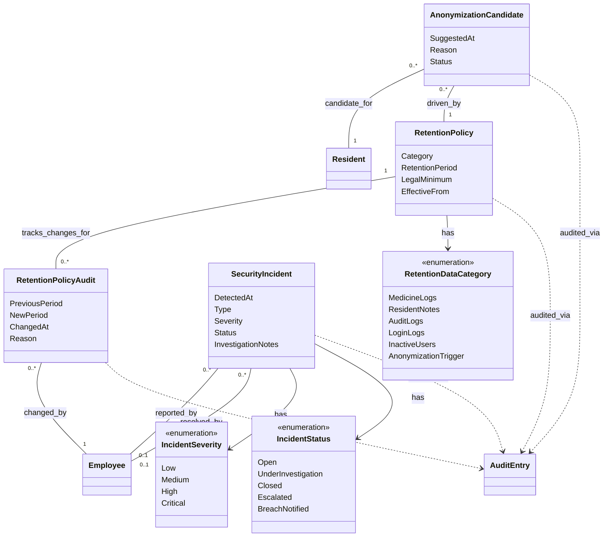

# Domain Model (DM) for UC-010 Ensure data security and GDPR compliance (Danish)

## Metadata
| Key            | Value |
|----------------|-------|
| Id             | UC-010.DM |
| crossReference | UC-010, UC-010.UC, UC-010.Wireframe |
| Author         | Team 6 |
| Version        | 0001 |
| Date           | 2026-05-11 |

## Version Log
| Version | Date       | Description | Author |
|---------|------------|-------------|--------|
| 0001    | 2026-05-11 | Initial     | Team 6 |

## Diagram

## Notes
- Denne domænemodel udvider den løsningsoverordnede domænemodel med 4 nye GDPR-specifikke entiteter.
- Alle tilstandsændringer på UC-010-entiteter logges automatisk via AuditInterceptor (UC-009).
- Medicine Logs i RetentionDataCategory har et låst lovpligtigt minimum på 10 år jf. Autorisationsloven §22.
- AnonymizationCandidate foreslås af RetentionBackgroundService (ikke oprettet af bruger); Admin godkender/afviser kun.
- SecurityIncident oprettes af IncidentDetectionService når mønstre matcher (fejlede logins, masseeksport, adgang uden for arbejdstid).
- Detaljerede typer, lag og metoder hører til i UC-010.DCD (Domain Class Diagram), som laves i en separat opgave.

## Terms Translation
| Original Term | Danish Translation |
|---------------|--------------------|
| Retention policy | Retention-politik / opbevaringspolitik |
| Legal minimum retention | Lovpligtigt minimum (opbevaring) |
| Anonymization candidate | Anonymiseringskandidat |
| Security incident | Sikkerhedshændelse |
| Personal data breach | Brud på persondatasikkerheden |
| Subject Access Request (SAR) | Indsigtsanmodning (SAR) |
| Audit log / audit trail | Audit-log / revisionsspor |
| Data minimization | Dataminimering |
| Art. 33 notification | Art. 33-underretning |
| Data Protection Officer (DPO) | Databeskyttelsesrådgiver (DPO) |
