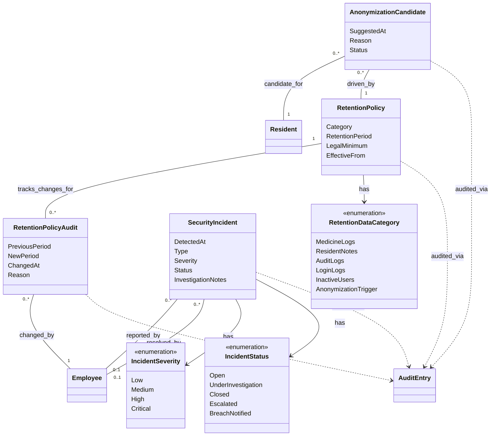

# Domain Model (DM) for UC-010 Ensure data security and GDPR compliance

## Metadata
| Key            | Value |
|----------------|-------|
| Id             | UC-010.DM |
| crossReference | UC-010, UC-010.UC, UC-010.Wireframe |
| Author         | Team 6 |
| Version        | 0001 |
| Date           | 2026-05-11 |

## Version Log
| Version | Date       | Description | Author |
|---------|------------|-------------|--------|
| 0001    | 2026-05-11 | Initial     | Team 6 |

## Diagram

## Notes
- This DM extends the solution-level domain model with 4 new GDPR-specific entities.
- All state changes on UC-010 entities are automatically captured by the AuditInterceptor (UC-009).
- The Medicine Logs entry in RetentionDataCategory has a locked legal minimum of 10 years per Autorisationsloven §22.
- AnonymizationCandidate is suggested by RetentionBackgroundService (not user-created); Admin only approves/rejects.
- SecurityIncident is created by IncidentDetectionService when patterns match (failed logins, mass exports, off-hours access).
- Detailed types, layers, and methods belong in UC-010.DCD (Domain Class Diagram), which will be created in a separate task.
