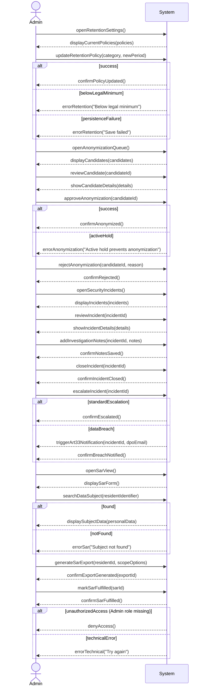

# System Sequence Diagram for Use Case UC-010: Ensure data security and GDPR compliance

## Metadata
| Key            | Value |
|----------------|-------|
| Id             | UC-010.SSD |
| crossReference | UC-010 UC-010.DM UC-010.UC |
| Author         | Team 6 |
| Version        | 0001 |
| Date           | 2026-05-11 |

## Version Log
| Version | Date       | Description | Author |
|---------|------------|-------------|--------|
| 0001    | 2026-05-11 | Initial     | Team 6 |

## System Sequence Diagram

