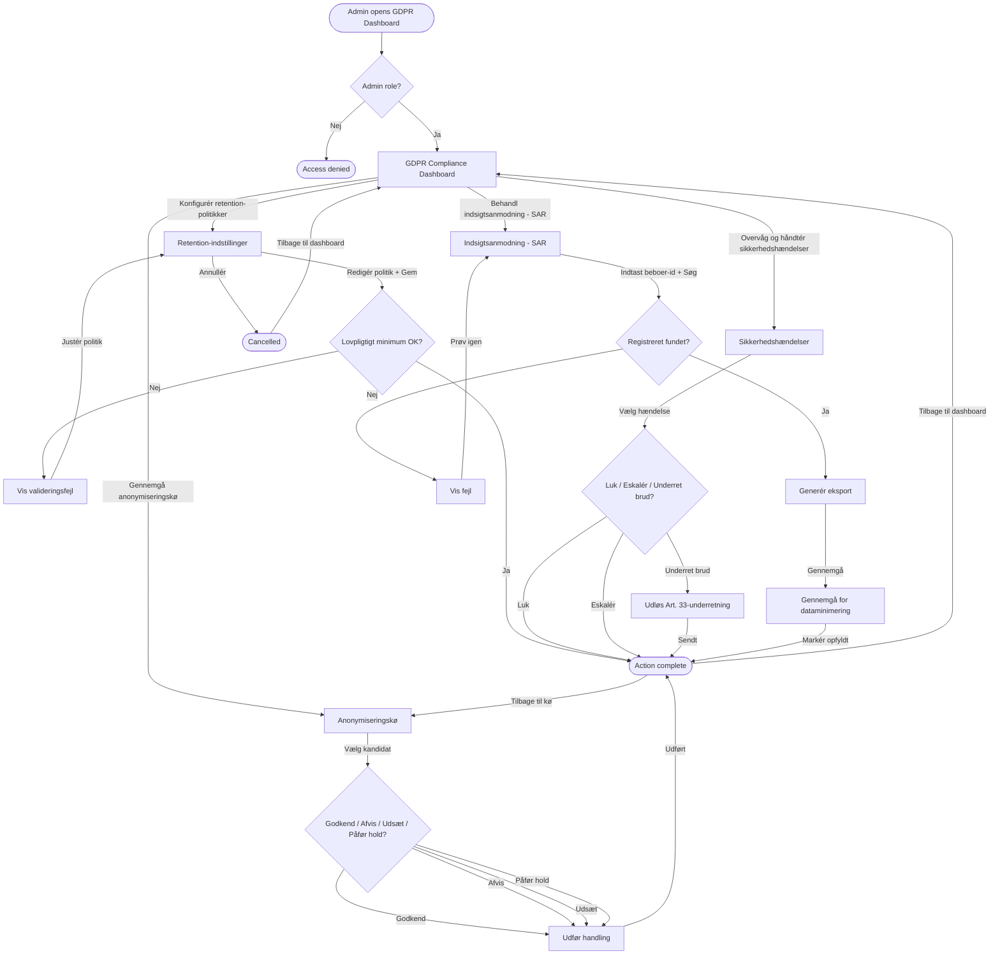

## Metadata
| Key            | Value |
|----------------|-------|
| Id             | UC-010.UserFlow |
| crossReference | UC-010 UC-010.UC UC-010.Wireframe |
| Title          | Ensure data security and GDPR compliance — User Flow Diagram (Danish) |
| Author         | Team 6 |
| Date           | 2026-05-11 |

## Version Log
| Version | Date       | Description | Author |
|---------|------------|-------------|--------|
| 0001    | 2026-05-11 | Initial     | Team 6 |

## User Flow Diagram
Dette brugerflow viser, hvordan en Admin navigerer i GDPR Compliance Dashboard for at konfigurere retention-politikker, gennemgå anonymiseringskandidater, overvåge og håndtere sikkerhedshændelser samt behandle indsigtsanmodninger (SAR).

## Notes
- Alle handlinger går via det eksisterende autentificerings-/autorisationslag (UC-007).
- Alle tilstandsændringer persisteres i audit-loggen via den eksisterende `AuditInterceptor` (UC-009).
- Baggrundsservices (RetentionBackgroundService, IncidentDetectionService) leverer anonymiseringskandidater og incident-signaler; disse er bevidst ikke visualiseret som brugertrin i diagrammet.
- Ikke visualiseret: advarsler om service health (fx service utilgængelig), "ingen afventende kandidater" samt tekniske fejl (fx fejl ved eksportgenerering med retry) — de håndteres som fejl-/statusbeskeder i UI, men er ikke udfoldet for at holde diagrammet under nodegrænsen.
