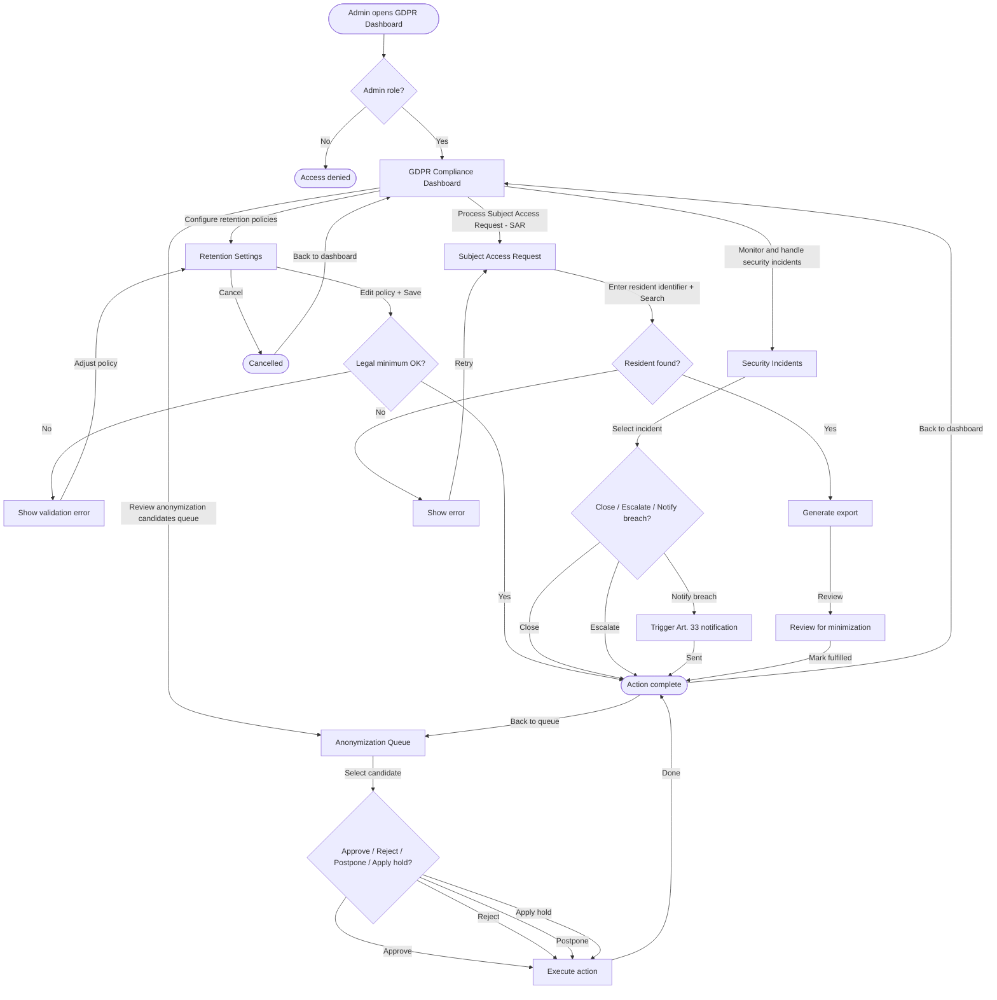

## Metadata
| Key            | Value |
|----------------|-------|
| Id             | UC-010.UserFlow |
| crossReference | UC-010 UC-010.UC UC-010.Wireframe |
| Title          | Ensure data security and GDPR compliance — User Flow Diagram |
| Author         | Team 6 |
| Date           | 2026-05-11 |

## Version Log
| Version | Date       | Description | Author |
|---------|------------|-------------|--------|
| 0001    | 2026-05-11 | Initial     | Team 6 |

## User Flow Diagram
This user flow shows how an Admin navigates the GDPR Compliance Dashboard to configure retention policies, review anonymization candidates, monitor and handle security incidents, and process Subject Access Requests (SAR).

## Notes
- All actions traverse through the existing authentication/authorization layer (UC-007).
- All state changes are persisted to the audit log via the existing `AuditInterceptor` (UC-009).
- Background services (RetentionBackgroundService, IncidentDetectionService) supply anonymization candidates and incident signals; these are intentionally not visualized as user-facing steps in the diagram.
- Not visualized: service-health warnings (e.g., candidate service unavailable), “no pending candidates”, and technical failures (e.g., export generation retry) — these are handled as user-facing errors/messages in the UI but are not expanded to keep the diagram under the node limit.
