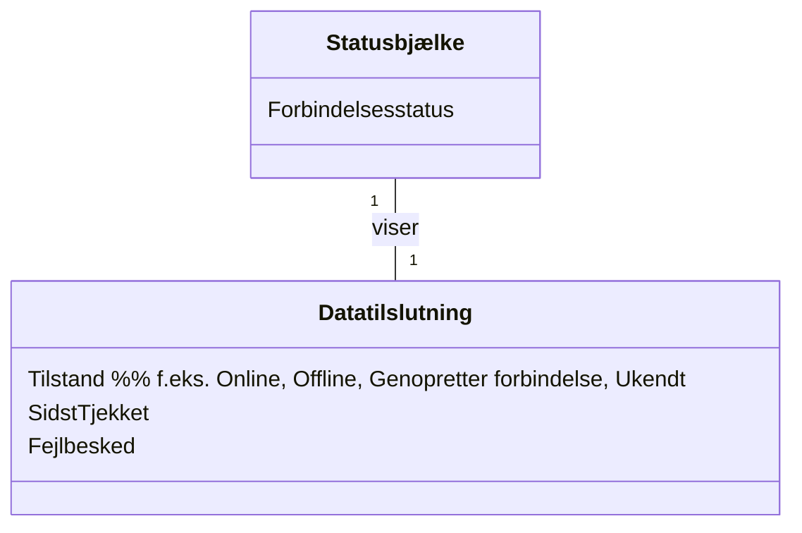

# Domænemodel (DM) for Slottets Drifttavlen
## Metadata
| Nøgle            | Værdi                             |
|------------------|-----------------------------------|
| Id               | UC-012.DM                         |
| crossReference   | BC                                |

## Versionslog
| Version | Dato       | Beskrivelse              | Forfatter     |
|---------|------------|--------------------------|---------------|
| 0001    | 2026-05-05 | Initial                  | Team 6        |

## Diagram

## Antagelser og afhængigheder
- Statusbjælken er altid synlig for brugeren.
- Datatilslutningens tilstand opdateres i realtid af systemet.
- Fejlbesked udfyldes kun, hvis forbindelsestilstanden er fejl/ukendt.
