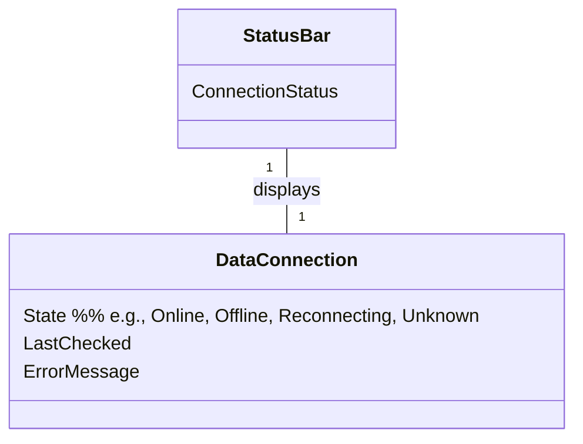

# Domain Model (DM) for Slottets Drifttavlen
## Metadata
| Key               | Value                             |
|-------------------|-----------------------------------|
| Id                | UC-012.DM                         |
| crossReference    | BC                                |

## Version Log
| Version | Date       | Description              | Author     |
|---------|------------|--------------------------|------------|
| 0001    | 2026-05-05 | Initial                  | Team 6     |

## Diagram

## Assumptions and Dependencies
- The status bar is always visible to the user.
- DataConnection state is updated in real time by the system.
- ErrorMessage is only populated if the connection state is error/unknown.

## Terms Translation
| Original Term      | Danish Translation         |
|-------------------|---------------------------|
| Status Bar        | Statusbjælke               |
| Data Connection   | Datatilslutning            |
| Connection Status | Forbindelsesstatus         |
| Online            | Online                     |
| Offline           | Offline                    |
| Reconnecting      | Genopretter forbindelse    |
| Unknown           | Ukendt                     |
| Error             | Fejl                       |
