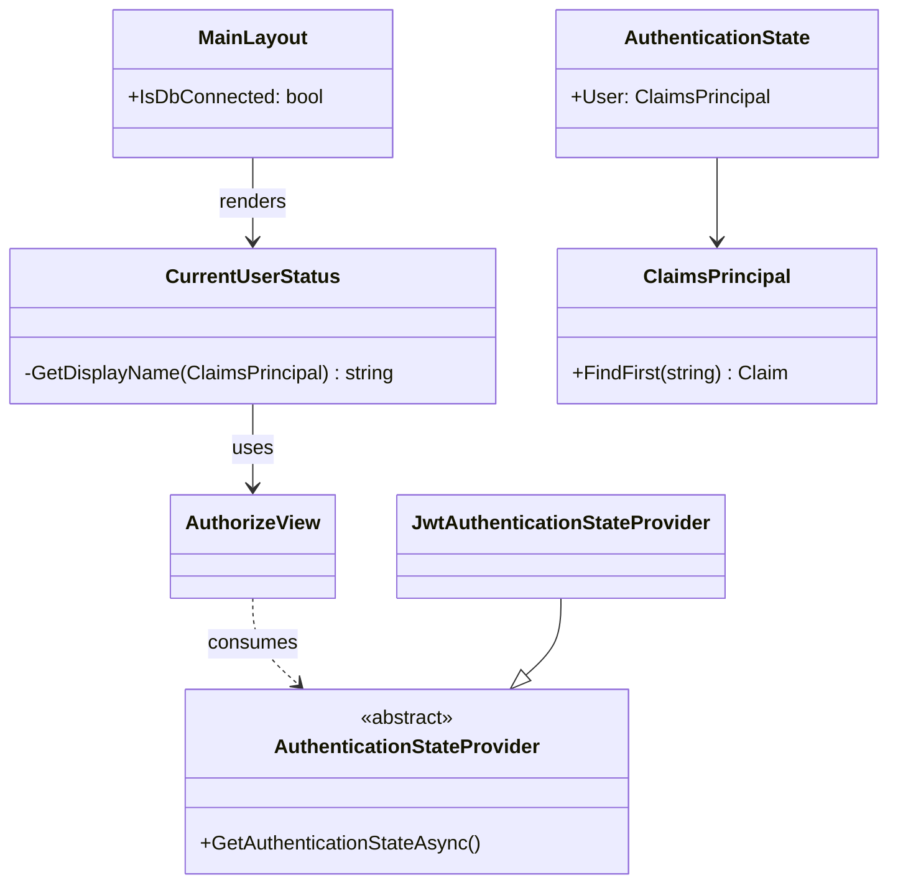

# UC-013 — Design Class Diagram

```mermaid
classDiagram
    class MainLayout { +IsDbConnected: bool }
    class CurrentUserStatus { -GetDisplayName(ClaimsPrincipal) string }
    class AuthorizeView
    class AuthenticationStateProvider {
        <<abstract>>
        +GetAuthenticationStateAsync()
    }
    class JwtAuthenticationStateProvider
    class AuthenticationState { +User: ClaimsPrincipal }
    class ClaimsPrincipal { +FindFirst(string) Claim }

    MainLayout --> CurrentUserStatus : renders
    CurrentUserStatus --> AuthorizeView : uses
    AuthorizeView ..> AuthenticationStateProvider : consumes
    JwtAuthenticationStateProvider --|> AuthenticationStateProvider
    AuthenticationState --> ClaimsPrincipal
```
