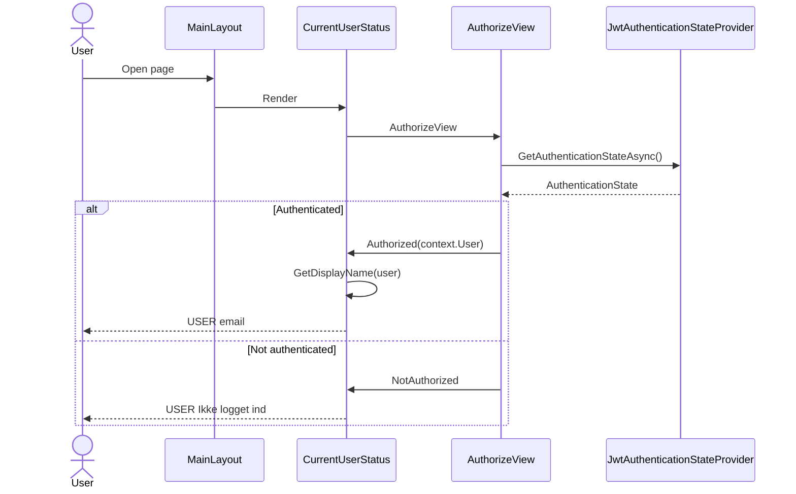

# UC-013 — Sequence Diagram

```mermaid
sequenceDiagram
    actor U as User
    participant ML as MainLayout
    participant CUS as CurrentUserStatus
    participant AV as AuthorizeView
    participant ASP as JwtAuthenticationStateProvider

    U->>ML: Open page
    ML->>CUS: Render
    CUS->>AV: AuthorizeView
    AV->>ASP: GetAuthenticationStateAsync()
    ASP-->>AV: AuthenticationState
    alt Authenticated
        AV->>CUS: Authorized(context.User)
        CUS->>CUS: GetDisplayName(user)
        CUS-->>U: USER email
    else Not authenticated
        AV->>CUS: NotAuthorized
        CUS-->>U: USER Ikke logget ind
    end
```
