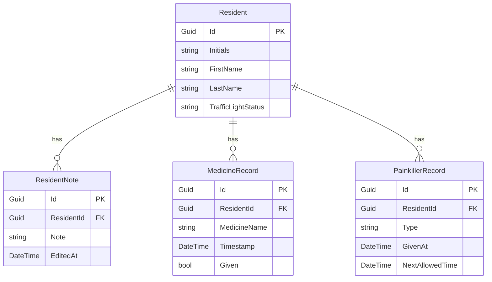

# Entity Relationship Diagram: UC-014 Citizen Administration

## Metadata
| Key               | Value                             |
|-------------------|-----------------------------------|
| Id                | ERD-UC-014                        |
| crossReference    | DCD-UC-014, UC-014                |

## Version Log
| Version | Date       | Description              | Author     |
|---------|------------|--------------------------|------------|
| 0001    | 2026-05-03 | Initial                  | Team 6     |

---

---

- All entities, attributes, and relationships are derived from the UC-014 DCD.
- TrafficLightStatus is represented as a string attribute for ERD simplicity.
- Foreign keys (ResidentId) are added to related records for relational clarity.
